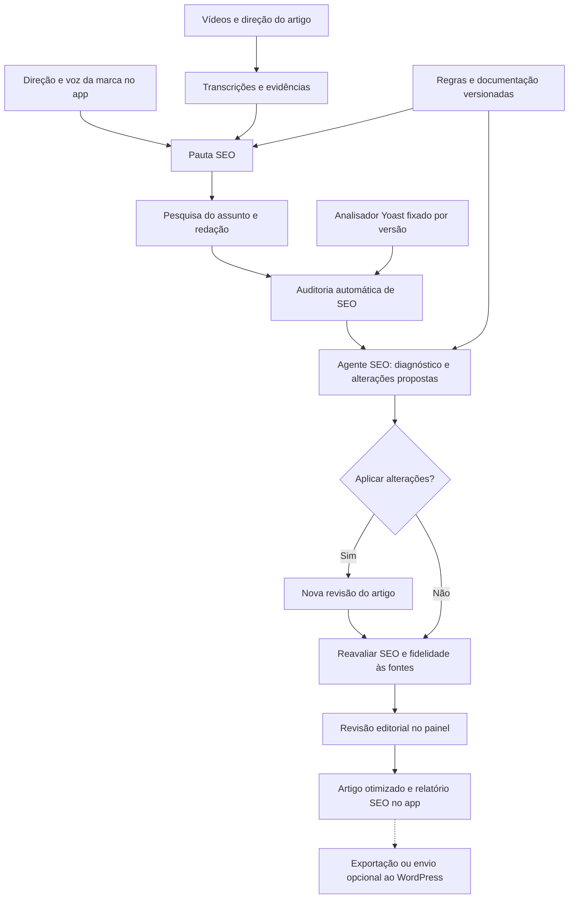

# Arquitetura proposta: SEO MASTER, Yoast SEO e descoberta em buscas com IA

Proposta revisada conforme o escopo confirmado: documentação e agentes de SEO dentro do aplicativo. Pesquisa documental: 05/10/2026. Base inicialmente inspecionada: commit `ddeaaa5`. O núcleo foi implementado na versão 1.1.0; [o registro de implementação](implementacao-redacao.md) distingue o escopo entregue das evoluções futuras descritas aqui.

A organização dos agentes foi detalhada em [Redação com equipes de três agentes](redacao-multiagentes.md): quatro setores com três papéis cada, voz editorial compartilhada e troca de propostas, críticas e decisões. As menções a “agente SEO” neste documento devem ser entendidas como a equipe de SEO definida nessa especificação.

## 1. Decisão central

Adicionar ao fluxo existente um agente editorial de SEO que consulta uma base própria de documentação oficial do Yoast e do Google, interpreta as orientações e analisa ou melhora o artigo dentro do SEO MASTER. O app armazena o conhecimento, seleciona as referências pertinentes, executa os agentes e apresenta o resultado.

Não é necessário cadastrar, inventariar ou conectar um site WordPress para essa funcionalidade. O perfil editorial vem da direção do artigo e das configurações de marca já existentes. A integração WordPress é uma entrega posterior e independente; não faz parte dos pré-requisitos do agente SEO.

O objetivo do produto continua sendo um artigo autônomo sobre o assunto das fontes, com voz da marca e informações sustentadas. A otimização deve preservar esse objetivo. A meta de qualidade é responder bem à necessidade do leitor, com conteúdo verificável e entrega técnica correta. A pontuação de um plugin é um sinal de diagnóstico, não uma previsão de posicionamento.

Separar três avaliações no app: fidelidade às fontes, SEO/legibilidade e utilidade editorial. Cada uma tem responsável, evidências e situação própria. A indisponibilidade de uma ferramenta deve aparecer como “não verificado”, nunca como aprovação. Condições técnicas de um site só entram quando essa integração opcional for desenvolvida.

## 2. O que o projeto já tem e o que precisa mudar

| Componente existente | Aproveitamento | Evolução necessária |
| --- | --- | --- |
| `generation.py` | Dossiê, redação, pesquisa e revisão com fontes | Retirar o checklist SEO simplificado para um módulo próprio e acrescentar contratos do agente SEO |
| `pipeline.py` | Etapas persistidas, retomada e fila | Dependências por versão, etapas SEO, retomada durável de tentativas e registro dos motivos de parada |
| `schemas.py` | Objetos validados para conteúdo e revisão | `KnowledgeDocument`, `SeoRule`, `SeoBrief`, `SeoAudit` e `ChangeSet` |
| `db.py` | SQLite, configurações privadas, histórico | Migrações e tabelas para documentos, regras, auditorias e execuções |
| `wordpress.py` | Rascunhos e reconciliação de envios | Exportação independente do agente; sincronização específica do Yoast em evolução opcional |
| `source_cache.py` | Reaproveitamento da transcrição | Manter o cache independente das regras de SEO |
| Editor web | Direção, fontes, revisão, pesquisa e histórico | Área SEO com diagnóstico, referências das regras, alterações propostas e comparação entre versões |

Hoje `seo_checks()` usa presença de palavra-chave e faixas fixas de caracteres. São heurísticas locais, não uma execução do Yoast. O conector atual envia título do post, corpo, resumo e slug; ainda não sincroniza título SEO, metadescrição ou palavra-chave do plugin.

Há também duas dependências importantes no renderizador atual: links livres são rejeitados pela validação e imagens/tabelas não fazem parte da lista de HTML permitida. Links internos, mídia e tabelas precisam de representação validada e renderização segura antes de entrarem nas recomendações automáticas.

## 3. Fundamentos confirmados na documentação

| Achado | Consequência arquitetural |
| --- | --- |
| A REST API tradicional do Yoast entrega metadados e é somente leitura. | Usá-la para conferir saída; não presumir que aceita gravação. [REST API](https://developer.yoast.com/customization/apis/rest-api/) |
| As novas Abilities oferecem leitura de dados do post e escrita de determinados campos técnicos; o contrato consultado não lista título SEO, metadescrição e palavra-chave como campos graváveis. | Descobrir as capacidades em cada instalação e prever um bridge para os campos editoriais ausentes. [Contrato das Abilities](https://developer.yoast.com/features/yoast-seo-abilities/posts-seo-data/) |
| O changelog 28.6, de 29/09/2026, registra as novas Abilities de dados de posts. | Não assumir que versões anteriores ou configurações desativadas oferecem essa interface. [Changelog](https://developer.yoast.com/changelog/yoast-seo/) |
| O Yoast publica seu analisador JavaScript e possui suporte de análise em português. | Executar uma versão fixada do motor, com cobertura explicitada por idioma e edição. [Código e documentação do analisador](https://github.com/Yoast/wordpress-seo/tree/trunk/packages/yoastseo) |
| As Abilities de pontuação leem resultados, não recebem um artigo arbitrário para analisá-lo. | Não substituir o motor local por uma chamada de leitura nem presumir que o resultado lido foi recalculado. [Analysis scores](https://developer.yoast.com/features/yoast-seo-abilities/analysis-scores/) |

Os contratos REST e Abilities acima servem como referência para uma integração futura. Os agentes do app consomem documentação selecionada e regras locais; não dependem dessas APIs. O pacote de conhecimento identifica orientações gerais e recursos específicos de Free/Premium, sem exigir conhecer uma instalação para analisar o conteúdo.

## 4. Fluxo completo



Regras de execução propostas:

1. Carregar a direção do artigo, idioma, palavra-chave, público e voz da marca definidos no app.
2. Reutilizar o dossiê factual e acrescentar a pauta SEO: intenção, pergunta principal, termos relacionados, lacunas e diferenciais. Links internos só entram se houver uma lista real de URLs fornecida ou uma integração opcional disponível.
3. Recuperar da base documental as regras aplicáveis ao formato e idioma, identificando a versão do pacote de referência adotado pelo app. Injetar esse pacote também na redação, para reduzir retrabalho.
4. Gerar o artigo sobre o assunto e calcular as verificações determinísticas.
5. O agente SEO devolve diagnóstico e propostas localizadas, evitando reescrever um artigo inteiro por um ajuste de metadescrição.
6. Criar uma versão candidata ao aplicar mudanças. Validar estrutura, referências e SEO; executar a revisão factual sobre a versão final, incluindo título, resumo e metadados.
7. Apresentar o artigo otimizado e seu relatório SEO dentro do app, prontos para edição e exportação.
8. O envio de rascunho permanece uma ação separada. Conferência remota de metadados e da URL pertence à integração opcional, sem interferir na análise local do conteúdo.

Prever um passe de otimização por padrão e um segundo passe opcional, configurável. Sem melhoria comprovada, preservar a melhor versão e apresentar a pendência. Não criar um ciclo aberto de reescritas até “ficar tudo verde”.

## 5. Documentação consumida pelos agentes

### Dois conjuntos de conhecimento separados

**Conhecimento do assunto:** transcrições, páginas pesquisadas, contribuições reais da marca e evidências do artigo.

**Conhecimento editorial/SEO:** documentação oficial do Yoast, orientações do Google, instruções documentadas de descoberta por outros provedores e regras editoriais próprias claramente identificadas.

Uma documentação SEO explica como avaliar um artigo; não comprova fatos do tema e não entra como material a ser parafraseado no corpo. Essa separação evita recriar o problema anterior de gerar uma análise das fontes em vez de ensinar o assunto.

### Como transformar documentação em entendimento utilizável

Para cada seção relevante, preparar uma ficha com a orientação original referenciada, explicação em português, finalidade, condições de aplicação, exemplos, exceções e forma de verificar uma correção. A ficha é uma interpretação editorial revisada; o trecho de origem permanece acessível para conferência.

Exemplo: uma recomendação sobre palavra-chave na introdução deve ser explicada como alinhamento entre abertura e tema do artigo. O agente avalia se a introdução deixa claro o assunto e sugere uma alteração natural quando necessário, sem transformar isso em obrigação de repetir palavras mecanicamente. As diferenças entre essa interpretação editorial e uma verificação literal do analisador devem ficar explícitas.

O agente redator recebe as orientações aplicáveis antes de escrever. O agente SEO recebe essas orientações, o artigo e as medidas locais para justificar e corrigir problemas. O revisor factual existente verifica que as correções preservaram os fatos. Esses papéis são etapas coordenadas dentro do app; não exigem serviços independentes nem uma instalação WordPress.

Esse entendimento é disponibilizado ao modelo em cada execução por instruções e recuperação de contexto. Carregar documentos não altera permanentemente os pesos do modelo. Fine-tuning não é requisito para esta arquitetura.

### Ingestão e publicação do conhecimento

Catálogo de URLs oficiais → coleta controlada → limpeza do texto → divisão por seção → identificação de versão/escopo → proposta de regras → revisão do pacote → versão ativa.

Cada registro documental deve guardar `document_id`, provedor, URL canônica, título, seção, idioma, data de coleta, data de atualização declarada quando disponível, hash, versão aplicável, licença/condição de uso e situação. Uma data de coleta não deve ser apresentada como data de publicação.

Guardar no armazenamento privado os trechos necessários e versões anteriores. No repositório público, publicar nosso catálogo, resumos próprios, regras e atribuições; não redistribuir indiscriminadamente cópias integrais de sites terceiros.

Começar com busca textual por seção e filtros de aplicabilidade em SQLite FTS5, verificando suporte na imagem do aplicativo. Acrescentar embeddings apenas se testes de recuperação mostrarem ganho. RAG aqui significa fornecer ao agente as referências relevantes recuperadas para aquele caso, sem enviar toda a documentação em cada geração.

Verificar alterações documentais em uma rotina semanal configurável e quando houver mudança de versão do plugin. A detecção cria uma versão candidata; regressões precisam passar antes da ativação. Uma página indisponível conserva o último pacote válido com aviso de desatualização. Todo artigo fixa a versão do pacote utilizada.

Conteúdo remoto é tratado como dado, sem poder conceder ferramentas ou mudar instruções do sistema. Regras obrigatórias já aprovadas entram por seleção determinística; não dependem apenas da busca semântica encontrar o trecho certo.

### Catálogo de regras

Cada regra inclui `rule_id`, versão, responsável, referência documental, aplicabilidade, classe, método de avaliação, prioridade e política de aplicação. Distinguir:

| Classe | Exemplo de tratamento |
| --- | --- |
| Requisito técnico verificável | Metadado gravado diverge do solicitado: corrigir entrega e não declarar sincronização concluída |
| Avaliação Yoast | Resultado do motor identificado por avaliação, idioma, versão e configuração |
| Orientação Google | Julgamento documentado com evidências; não apresentar como “certificação Google” |
| Preferência editorial da marca | Tom de voz e estilo, sem atribuir a preferência ao Google ou Yoast |
| Hipótese de melhoria | Clareza de uma resposta ou melhor organização; testar e justificar, sem promessa de ranking |

Saídas permitidas: `pass`, `warning`, `fail`, `not_applicable`, `unknown`. A regra pode estar correta e não se aplicar ao artigo. Uma recomendação de legibilidade não deve bloquear o rascunho como se fosse um erro factual.

## 6. Motor de análise e agente SEO

### Motor reproduzível

Como evolução da validação local, criar `services/yoast-analyzer/` em Node, encapsulando o pacote oficial `yoastseo`. Escolher uma versão publicada, fixar dependências e testar com exemplos em português. O código consultado em `trunk` é referência de desenvolvimento, não uma versão de produção a instalar automaticamente. A base documental e o primeiro agente podem ser entregues antes desse motor, identificando quais verificações usam IA ou código próprio.

Quando o motor for incorporado, incluir esse executável no mesmo Docker do FastAPI e chamá-lo por JSON via entrada/saída padrão, com timeout, limite de memória e comando fixo. Isso mantém a instalação no EasyPanel simples e dispensa uma nova API pública. O adaptador pode migrar para um serviço privado no grupo `mj` caso a carga justifique.

Entrada proposta: artigo, HTML de entrega, título SEO, descrição, slug, palavra-chave, localidade, tipo de conteúdo e perfil editorial do app. Um template de marca pode ser configurado no app. Comparações em português exigem normalização compatível, não simples contagem de substrings.

Produzir resultados por avaliação, identificação do motor, cobertura, duração e hash de entrada. Qualquer medição de largura de snippet exige configuração reproduzível e indicação de que é prévia. Funcionalidade não disponível na versão/edição retorna `unknown` ou `not_applicable` conforme o caso.

Não prometer igualdade com o painel WordPress sem testar os mesmos dados, versões, idioma e configurações. Exibir separadamente “análise local” e “resultado observado no WordPress”.

### Agente editorial de SEO

O agente recebe a versão atual, pauta, fontes do assunto, verificações disponíveis e pacote documental. Uma lista de links reais é opcional. Entrega um objeto validado, não uma redação livre sobre o que deveria ser feito:

```json
{
  "article_revision": "rev-12",
  "ruleset_version": "seo-2026-10-v1",
  "editorial_profile_version": "marca-v2",
  "findings": [{
    "rule_id": "editorial.answer_clarity",
    "status": "warning",
    "location": "intro.paragraph-1",
    "reason": "A abertura demora a responder à pergunta da pauta.",
    "documentation_refs": ["doc-id:section-id"]
  }],
  "changes": [{
    "operation": "replace_paragraph",
    "target": "intro.paragraph-1",
    "expected_old_hash": "hash-do-trecho",
    "new_text": "Texto candidato, preservando as referências existentes.",
    "evidence_ids": ["v1s2"],
    "reason_rule_ids": ["editorial.answer_clarity"]
  }],
  "research_requests": []
}
```

Operações aceitas são definidas pelo aplicativo. O agente não recebe acesso irrestrito ao banco ou ao WordPress. Toda mudança precisa atingir a revisão exata; edição manual concorrente invalida a aplicação. O backend recalcula os indicadores após a mudança, sem aceitar um “melhorou” declarado pelo próprio agente.

Usar modo assistido inicialmente, com comparação antes/depois, aplicação individual ou conjunta e desfazer. Oferecer modo automático configurável no app para alterações previamente autorizadas. Mudanças de fatos, intenção ou autoria exigem tratamento próprio; não são ajustes rotineiros para melhorar uma pontuação.

Perguntas, exemplos ou benefícios novos só entram com suporte. Se uma otimização revelar falta de informação, o agente solicita pesquisa direcionada; não completa de memória. Também não inventa experiência própria, credenciais ou dados de busca.

## 7. SEO para Google e descoberta por IA

A orientação oficial atual do Google mantém os fundamentos de SEO e dispensa arquivos ou marcações especiais para aparecer nas experiências generativas. Usar perguntas claras, respostas úteis e organização adequada é uma decisão editorial; não uma fórmula secreta de AEO/GEO. [Guia atual do Google](https://developers.google.com/search/docs/fundamentals/ai-optimization-guide)

O sistema deve avaliar valor acrescentado: explicações que resolvem dúvidas, comparação sustentada, organização útil, fontes claras e contribuição real da marca quando houver. Uma redação diferente das fontes não garante, sozinha, valor adicional. Registrar oportunidades de contribuição própria sem inventá-la. [Conteúdo útil](https://developers.google.com/search/docs/fundamentals/creating-helpful-content)

Verificar repetição artificial de palavras-chave, páginas quase idênticas e produção de variantes sem finalidade para o leitor. A finalidade da automação é assistência editorial. [Políticas de spam](https://developers.google.com/search/docs/essentials/spam-policies)

Faixas como “30–65 caracteres” e “120–165 caracteres” devem aparecer como recomendações configuráveis, não limites obrigatórios do Google. Títulos e snippets podem ser apresentados de maneira diferente nos resultados. [Títulos](https://developers.google.com/search/docs/appearance/title-link), [snippets](https://developers.google.com/search/docs/appearance/snippet)

Para descoberta, manter um diagnóstico técnico por provedor, separado da avaliação do texto:

| Canal | Verificações propostas |
| --- | --- |
| Google Search e recursos generativos | Acesso ao conteúdo, indexabilidade, elegibilidade de snippet, configuração de participação em recursos generativos, links internos e saída técnica coerente |
| ChatGPT Search | Acesso por `OAI-SearchBot`, robots e eventuais bloqueios de infraestrutura; decisões sobre `GPTBot` ficam separadas |
| Outros provedores | Adaptadores futuros com documentação própria; não aplicar as regras de um fornecedor a todos |

O Google documenta a participação em recursos generativos via Search Console em seu guia mais recente; conferir essa configuração com a conta do site, sem inferi-la a partir do robots.txt. Acesso de rastreador, elegibilidade e presença observada são estados diferentes. [Guia de IA do Google](https://developers.google.com/search/docs/fundamentals/ai-optimization-guide)

Na OpenAI, controle de busca e controle de treinamento são independentes. Permitir `OAI-SearchBot` não exige permitir `GPTBot`. Verificar também CDN/firewall; um teste HTTP comum do nosso servidor não comprova acesso pelos IPs reais do rastreador. [OpenAI Crawlers](https://developers.openai.com/api/docs/bots)

Não acrescentar `llms.txt`, FAQs obrigatórias, schema especial de IA ou blocos artificiais como requisitos de sucesso. Usar tabelas, listas e perguntas quando ajudarem o leitor. [Google sobre práticas para IA](https://developers.google.com/search/docs/fundamentals/ai-optimization-guide)

## 8. Evolução opcional: contexto de vários sites

Esta seção não integra o caminho inicial. Um inventário pode enriquecer sugestões de links e sobreposição temática depois; sua ausência não impede que os agentes consultem a documentação e otimizem um artigo no SEO MASTER.

Adicionar `site_id` ao artigo e um perfil separado para cada WordPress: URL, credenciais cifradas, idioma, marca, templates SEO, tipo de post, autores reais, taxonomias, capacidades Yoast e preferências de automação. Migrar a configuração global atual para um site padrão, preservando artigos existentes.

O inventário deve reunir páginas reais, títulos, descrições, URLs canônicas, datas e temas, com sincronização incremental e paginação. Usá-lo para sugerir links relevantes e detectar possível sobreposição temática. Sem inventário completo, a ausência de duplicidade é “não verificada”.

Não inventar volume de busca, dificuldade ou tráfego. A palavra-chave inicial é uma hipótese editorial; Search Console ou outro provedor de dados pode acrescentar sinais observados. Sem acesso a esses dados, a interface deve indicar a origem editorial da sugestão.

Links internos precisam apontar para páginas existentes e pertinentes. Registrar IDs de páginas e âncoras, evitando URLs arbitrárias geradas pelo modelo. Links de navegação não se tornam automaticamente evidências factuais. Imagens exigem mídia real e descrição conhecida antes de receber texto alternativo específico.

## 9. Evolução opcional: integração WordPress e Yoast

O agente funciona sem este conector. A seção descreve somente uma futura sincronização dos resultados que já foram produzidos no app.

Descobrir capacidades, selecionar adaptador e verificar o resultado. Não instalar, atualizar ou alterar configurações de plugins como efeito colateral de gerar um artigo.

| Caminho | Uso previsto |
| --- | --- |
| WordPress REST API | Criar/atualizar o rascunho e seus campos nativos |
| Yoast REST / Abilities disponíveis | Leitura de metadados, capacidades e resultados que a instalação exponha |
| Plugin próprio `SEO MASTER Bridge` | Gravação dos campos editoriais faltantes, com contrato restrito e suporte testado por versão |
| Exportação | Alternativa explícita quando o site ainda não suporta sincronização completa |

O bridge deve disponibilizar apenas os campos acordados, validar tipos e permissões de edição do post e usar as APIs do WordPress. Uma rota autenticada própria é preferível a expor todo o postmeta. `register_post_meta`/`register_rest_field` são mecanismos possíveis, a serem escolhidos e testados na implementação. [Extensão da REST API](https://developer.wordpress.org/rest-api/extending-the-rest-api/modifying-responses/)

Prioridade de sincronização: título SEO, metadescrição e palavra-chave. Campos sociais e tipos de schema entram depois. Não gravar pontuações internas para fabricar aprovação no Yoast. O adaptador verifica atualização de indexables e da saída renderizada conforme a versão suportada; se não conseguir confirmar, a entrega permanece parcialmente verificada.

Manter o Yoast como responsável principal pelo grafo de dados estruturados, evitando duplicá-lo no corpo do post. Ajustes devem refletir autor, imagens e conteúdo reais. [Schema do Yoast](https://developer.yoast.com/features/schema/), [Article no Google](https://developers.google.com/search/docs/appearance/structured-data/article)

Sequência da entrega: guardar intenção e versão → reconciliar/criar rascunho → aplicar campos SEO → reler e comparar → registrar recibo. Se o texto for salvo e o metadado falhar, mostrar “rascunho criado, SEO pendente” e tentar novamente só a etapa incompleta. Não criar outro post.

O recibo deve identificar site, post, revisão enviada, campos solicitados/salvos/renderizados, data, mecanismo e pendências. Antes de atualizar, conferir a versão remota para não sobrescrever edições feitas no WordPress. Preservar snapshots dos valores substituídos para recuperação.

## 10. Dados, operações e interface

Entidades iniciais: `knowledge_documents`, `knowledge_sections`, `rule_sets`, `seo_audits`, `change_sets`, `pipeline_runs` e `stage_attempts`. Vincular tudo à revisão do artigo e ao perfil editorial correto. `sites`, `site_capabilities`, `site_pages` e `delivery_receipts` pertencem à evolução opcional de integração.

Chave de reutilização de auditoria: hash do artigo + pauta SEO + perfil editorial + pacote documental + versão/configuração dos verificadores. Se houver contexto externo opcional, incluir sua versão. Mudar texto invalida auditorias; mudar regra não exige baixar o vídeo de novo.

Manter FastAPI e SQLite na primeira entrega, com migrações, transações e uma réplica. Evoluir a fila para execuções persistidas e tentativas com prazo de posse, heartbeat e idempotência, para retomar trabalho sem depender apenas da memória do processo. Medir espera, latência, falhas e concorrência; migrar para PostgreSQL e workers separados antes de operar múltiplas réplicas escritoras. Redis só entra se houver necessidade medida de fila distribuída.

APIs iniciais propostas no aplicativo: `GET /seo/knowledge/status`, `GET /seo/rules/{rule_id}`, `POST /jobs/{id}/seo-audit`, `POST /jobs/{id}/seo-proposals` e `POST /jobs/{id}/changes/{change_id}/apply`. Operações demoradas retornam um identificador de execução e aceitam chave de idempotência. Cada mutação valida a revisão esperada. Rotas de sites e confirmação remota entram apenas na integração posterior.

No painel, criar “Análise SEO” com conteúdo, legibilidade e metadados. Mostrar problemas concretos, situação, explicação, trecho afetado, fonte da regra e ação possível. Oferecer comparar/aplicar/desfazer e consultar a orientação documental. A situação “não verificado” não deve se transformar em vermelho nem em verde. Manter a aba Fontes para as evidências do assunto e uma área distinta para as referências SEO. Diagnósticos de site e entrega ficam para a integração opcional.

Custos: verificações determinísticas antes das chamadas de IA, pacote documental reutilizado, uma proposta agrupada por passe e registros de tokens/etapa. Orçamento e quantidade de passes são configuráveis. Erros de integração não devem disparar nova redação. Preços para estimativas precisam de catálogo atualizado; não misturar tokens, chamadas e custo monetário como se fossem a mesma medida.

## 11. Medição e critérios de aceite

Medir tempo e custo por artigo, taxa de aceite das propostas, ajustes revertidos, novos erros factuais após otimização, referências quebradas, divergência entre análise local e WordPress, falhas de sincronização e recuperação de tentativas.

Após a publicação, acompanhar impressões, cliques, consultas, CTR e páginas no Search Console, quando autorizados e disponíveis. Para IA, o Google anunciou relatórios próprios de impressões em recursos generativos em 2026. Não presumir que toda métrica da interface está disponível na API; validar o contrato e oferecer importação/exportação quando necessário. [Anúncio oficial](https://developers.google.com/search/blog/2026/06/gen-ai-performance-reports)

Referências de tráfego de ferramentas de IA e conversões complementam a medição. Ausência de referência não prova ausência de exposição. Presença em respostas de IA pode variar; um teste isolado não representa cobertura total. Não usar uma “nota de GEO” inventada como resultado de negócio.

Critérios de aceite para a análise dentro do app:

- Uma suíte de artigos em português com intenção prática e conceitual; o agente conserva o tema, fontes, ressalvas e voz da marca.
- Casos de palavra-chave ausente, repetição excessiva, parágrafos longos e melhorias desnecessárias, incluindo situações em que o correto é não alterar.
- Toda regra apresentada aponta para sua origem; instruções de marca não são atribuídas ao Google.
- Verificações locais reproduzíveis em um conjunto fixo de exemplos; cada resultado identifica se veio de IA, regra própria ou motor Yoast.
- Alteração de artigo invalida auditoria; aplicação sobre versão desatualizada falha sem sobrescrever conteúdo.
- Links e fatos acrescentados precisam de validação; orientações SEO não contam como evidência do assunto.
- A geração e a análise SEO funcionam com nenhuma conexão WordPress configurada.
- Título SEO, metadescrição e palavra-chave são entregues em campos próprios no app.
- Mudança de documentação ou analisador passa por regressão antes de substituir a versão ativa.

Na integração posterior, acrescentar testes contra instalações reais, confirmação de metadados, privacidade de rascunhos, conflito de edição e recuperação de entrega parcial.

## 12. Sequência de implementação recomendada

| Etapa | Entrega concreta | Condição para avançar |
| --- | --- | --- |
| 1. Documentação e interpretação | Catálogo oficial, trechos organizados, fichas explicadas, exemplos e primeiro pacote de regras | Cada orientação rastreável e interpretação revisada |
| 2. Contexto nos agentes | Recuperação de regras para pauta, redação e auditoria; contratos de entrada e saída | Agentes usam as orientações pertinentes sem misturar SEO com fatos do assunto |
| 3. Análise e melhoria no app | Diagnóstico, propostas localizadas, comparação, aplicação e revisão final | Funciona sem site conectado e melhora os casos de teste sem regressão factual |
| 4. Validação aprofundada | Motor Yoast local e expansão da suíte de avaliações em português | Cobertura e limitações identificadas por versão do motor |
| 5. Integrações opcionais | Inventário de páginas, campos WordPress/Yoast e acompanhamento | Só após concluir a funcionalidade central no app |

A primeira entrega é a base documental interpretada e utilizável pelos agentes dentro do SEO MASTER. Em seguida, validar o agente com artigos de teste locais, comparando problemas detectados, justificativas e correções. Versão do plugin instalado, site de teste e Search Console só são necessários se avançarmos para as integrações opcionais.
