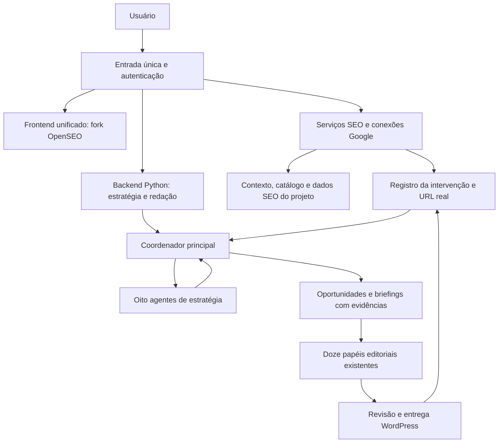

# SEO MASTER: OpenSEO integrado e inteligência orgânica

Data: 06/10/2026.
Situação: especificação proposta, baseada no código existente e no upstream `every-app/open-seo`, tag `v0.1.9`. Este documento não representa uma integração já implementada ou uma previsão de crescimento.

## Objetivo e decisões de produto

Transformar o SEO MASTER em uma plataforma que conhece o negócio, identifica oportunidades de busca, escolhe ações, produz conteúdo fundamentado e acompanha seus resultados. A meta principal é aumentar cliques orgânicos relevantes. Impressões, CTR, cobertura temática e conversões ajudam a explicar e priorizar esse resultado.

O usuário definiu que os dados do site serão conectados no OpenSEO e que o OpenSEO deverá ser modificado e incorporado ao produto. A URL e o nicho serão obtidos do projeto conectado, sem exigir um segundo cadastro para a inteligência estratégica.

Decisões propostas:

- Manter um fork do OpenSEO `v0.1.9` como base da interface unificada e das funções de análise SEO.
- Acrescentar nesse fork as telas nativas de estratégia, redação, imagens e entrega WordPress do SEO MASTER, com a mesma navegação, identidade visual e seleção de projeto.
- Usar um coordenador principal e oito agentes especializados para a estratégia do site. A redação atual, com doze papéis, executa os briefings escolhidos.
- Preservar o YouTube como fonte central de conteúdo: vídeos fornecidos pelo usuário, canais aprovados e vídeos descobertos para as pautas. Aproveitar explicações, exemplos, dúvidas e relatos atribuídos, com pesquisa complementar e materiais do negócio.
- Reaproveitar o backend Python de redação, persistência, revisão e WordPress. Os serviços internos podem continuar separados, com um domínio público e uma sessão para o usuário.
- Guardar decisões, evidências e resultados por projeto, permitindo explicar por que uma pauta foi escolhida e o que aconteceu depois.
- Na primeira versão, automatizar análise e planejamento. Produção consome o orçamento configurado e passa pela revisão editorial existente; envio WordPress continua como postagem pendente de revisão.

O efeito desejado é um fluxo contínuo: conhecer → diagnosticar → escolher a pauta → selecionar vídeos e fontes → apurar e pesquisar → produzir → revisar → entregar → medir → ajustar.

## O que foi verificado

### No SEO MASTER atual

- `app/editorial/engine.py`: coordenação editorial persistida, recuperação de etapas, evidências, propostas e limites de chamadas.
- `app/editorial/agents.py`: doze papéis em apuração, redação, SEO do artigo e qualidade final.
- `app/schemas.py`: `Brief` exige de um a cinco links do YouTube; o perfil atual contém marca e voz, sem inventário estruturado do negócio.
- `app/pipeline.py`: fila em uma instância, com um trabalho em execução. Não oferece oito execuções paralelas de estratégia.
- `app/wordpress.py`: conexão e entrega para revisão. Não faz inventário completo do WordPress ou sincronização dos campos de plugins SEO.
- `app/db.py` e `app/security.py`: SQLite, sessões, origem/CSRF e segredos cifrados.
- `app/static/`: interface atual em HTML, CSS e JavaScript. Incorporar as telas ao frontend React exige adaptação real dos componentes.

### No OpenSEO v0.1.9

O [registro de ferramentas MCP da tag](https://github.com/every-app/open-seo/blob/v0.1.9/src/server/mcp/server.ts) confirma recursos úteis para o produto:

| Área | Ferramentas que podemos reutilizar |
| --- | --- |
| Projeto e contexto | `list_projects`, `get_project_context`, `update_project_context` |
| Search Console | `get_search_console_performance`, `inspect_urls` |
| GA4 | `get_google_analytics_organic_landing_pages`, `get_google_analytics_key_events`, `get_google_analytics_measurement_health`, `get_search_opportunities` |
| Pesquisa e concorrentes | `research_keywords`, `get_keyword_metrics`, `get_serp_results`, `get_ranked_keywords`, `find_serp_competitors` |
| Ranking | `get_rank_tracker`, `estimate_rank_tracker_cost`, `run_rank_tracker` |
| Auditoria | `run_site_audit`, `get_audit_status`, `get_audit_issues`, `get_audit_pages` |
| Relatórios | `save_report`, `list_reports`, `get_report` |

Essa lista vem do código da versão solicitada. A disponibilidade em uma instalação depende das conexões, permissões e configuração dos serviços.

O [contexto de projeto](https://github.com/every-app/open-seo/blob/v0.1.9/src/server/mcp/tools/project-context.ts) já guarda negócio, objetivo, posicionamento, preferências, concorrentes, páginas importantes e histórico de pesquisa. Ele serve como resumo compartilhado. Catálogo completo, texto das páginas, evidências e séries históricas precisam de armazenamento estruturado adicional.

O [modo Docker](https://github.com/every-app/open-seo/blob/v0.1.9/docs/SELF_HOSTING_DOCKER.md) usa `local_noauth`: exige rede privada ou um proxy com autenticação. A implantação unificada deve proteger também as rotas de servidor e APIs, além das telas. Os dados externos usam DataForSEO, com cobrança conforme o uso. SAM é um agente já existente, mas o coordenador de oito especialistas exige desenvolvimento próprio.

O [upstream usa licença MIT](https://github.com/every-app/open-seo/blob/v0.1.9/LICENSE); o fork deverá manter a licença e o aviso de autoria. A base de implantação será fixada em `ghcr.io/every-app/open-seo:v0.1.9`, com registro do commit e do digest efetivamente usados.

## Uma única plataforma

A recomendação é ampliar o frontend React/TypeScript do OpenSEO para receber o estúdio editorial. Isso permite reaproveitar as telas de projeto, pesquisa, Search Console, GA4, ranking e auditoria, que constituem a maior parte da superfície nova.

O menu do projeto terá:

1. Visão geral: evolução orgânica, qualidade das conexões, metas e próximas ações.
2. Inteligência: diagnóstico, oito pareceres, decisão do coordenador e evidências.
3. Oportunidades: fila priorizada de criação, atualização, consolidação e correções propostas.
4. Plano de conteúdo: clusters, páginas responsáveis e calendário.
5. Redação: fontes, pauta, editor, agentes editoriais, revisão e imagens.
6. WordPress: associação das páginas, versões e envios para revisão.
7. Resultados: desempenho por página, cluster e intervenção.
8. Pesquisa SEO: recursos existentes do OpenSEO, organizados no mesmo menu.
9. Projeto e integrações: negócio, produtos, público, Google, WordPress e orçamento.

Não haverá uma tela embutida por iframe. As páginas de redação serão componentes da interface unificada, consumindo os contratos do backend atual.

A área de fontes preservará a entrada manual de links do YouTube e acrescentará vídeos sugeridos para cada pauta, canais aprovados, trechos utilizados, pesquisas complementares e histórico de reaproveitamento. O usuário poderá iniciar um artigo por um vídeo ou por uma oportunidade de busca; os dois caminhos convergem na mesma redação.

### Organização dos serviços

Os dados SEO continuam pertencendo ao serviço OpenSEO; trabalhos e versões editoriais continuam pertencendo ao Python. O vínculo é `project_id`, com mapeamento explícito de projeto OpenSEO, site, propriedades Google, trabalho editorial e postagem WordPress. A interface não exige duplicar essas configurações.

A tela integrada salva cada segredo no serviço que o utiliza e mostra somente o estado da conexão. Ela não copia chaves para o navegador ou para o contexto dos agentes.

### Sessão e rotas

Para a instalação atual, com um administrador, preservar a sessão privada do SEO MASTER na entrada única. O OpenSEO pode operar em rede interna sob a autenticação da plataforma. Acrescentar um endpoint interno de verificação de sessão e aplicar a proteção a todo pedido que alcançar o serviço SEO.

Proposta de roteamento:

| Entrada pública | Destino interno |
| --- | --- |
| Interface e rotas SEO originais | Fork OpenSEO, mantendo as rotas exigidas pelo TanStack |
| `/api/editorial/*` | Backend Python, com mapeamento para as rotas `/api/*` existentes |
| `/api/strategy/*` | Novo módulo estratégico no Python |
| Callbacks Google originais | Fork OpenSEO, com origem pública e estado OAuth validados |
| MCP | Acesso interno pelo coordenador; sem exposição pública na primeira entrega |

Login, arquivos públicos estritamente necessários e callbacks OAuth terão tratamento específico. O retorno do Google exige verificar estado e a interação com a política de cookies atual; não basta liberar um prefixo inteiro de API. Logout e revogação devem encerrar o acesso a ambas as áreas.

Modificar a identidade visual, a navegação e os guardas de acesso do fork. Evitar colisões entre as APIs e preservar os caminhos de funções de servidor e assets do OpenSEO. Testar o domínio público real, links profundos e callbacks sob o proxy antes da implantação.

Um projeto selecionado acompanha todo o fluxo. Trabalhos antigos precisam de associação explícita na migração; nenhum artigo é automaticamente atribuído a um site desconhecido. O escopo inicial continua sendo um administrador, sem pressupor um SaaS multiusuário.

## Conhecimento do negócio e do site

O cadastro no projeto OpenSEO será a fonte principal para:

- Nicho, público, região, idioma e objetivos comerciais.
- Produtos e serviços, categorias, disponibilidade, atributos confirmados e URLs comerciais.
- Diferenciais comprovados, dúvidas frequentes, restrições e materiais próprios.
- Conteúdo publicado, páginas de produto, categorias, páginas institucionais e fontes aprovadas.
- Concorrentes cadastrados e concorrentes encontrados nas SERPs relevantes.
- Voz editorial e diretrizes utilizadas pela redação.

Informações ausentes aparecem como pendências. O agente pode propor uma interpretação do negócio com base no site, mas essa interpretação fica identificada como hipótese até confirmação no perfil.

O inventário combina páginas já rastreadas pelo OpenSEO, sitemap e leitura autorizada de posts/páginas do WordPress. O relatório de auditoria fornece metadados; ele não substitui a ingestão do conteúdo necessário à redação. Produtos podem vir de páginas públicas, cadastro estruturado ou conector WooCommerce quando esse plugin estiver presente.

Cada documento conserva URL, projeto, tipo, conteúdo ou trecho utilizado, data de coleta, hash e origem. O sistema relaciona produtos, perguntas, consultas, clusters e páginas existentes. Atualizações invalidam os resumos e decisões que dependem da versão anterior.

Usar busca textual e filtros estruturados inicialmente. Acrescentar busca por embeddings quando o corpus e a avaliação de recuperação justificarem. Os agentes recebem trechos pertinentes, com referências, em vez de todo o site em cada chamada.

## Coordenador principal e oito agentes

O coordenador define a pergunta da rodada, escolhe quais especialistas executar, controla chamadas e custos, resolve conflitos e monta o plano. Cada especialista tem ferramentas e contrato próprios. O coordenador também faz inferências; a validação das evidências, escopo e métricas ocorre no código.

| Agente | Pergunta que precisa responder | Entrega |
| --- | --- | --- |
| 1. Negócio e nicho | Quais temas ajudam o público e os produtos deste negócio? | Mapa do negócio, prioridades comerciais, restrições e lacunas de contexto |
| 2. Desempenho no Google | Onde já há demanda, perda de cliques ou oportunidades nas páginas atuais? | Diagnóstico Search Console segmentado, com períodos e consultas/páginas reais |
| 3. Público e intenção | O que o pesquisador quer resolver e qual formato atende essa necessidade? | Intenção, estágio da jornada, dúvidas e formato, apoiados em pesquisa e sinais disponíveis |
| 4. SERP e concorrentes | Quem aparece para as consultas relevantes e o que explica a oportunidade? | Análise de resultados, formatos dominantes, concorrentes e lacunas que podemos atender |
| 5. Arquitetura de conteúdo | Qual página deve responder cada intenção e como o conjunto se conecta? | Clusters, páginas responsáveis, links internos e possíveis sobreposições |
| 6. Saúde técnica | Existe um problema de rastreamento, indexação ou implementação que afete a ação? | Diagnósticos e tarefas técnicas com URLs, gravidade e evidências |
| 7. Curadoria e planejamento editorial | Quais vídeos e outras fontes sustentam o conteúdo ou atualização escolhidos? | Seleção justificada de vídeos, trechos úteis, lacunas para pesquisa, briefing e diferencial editorial |
| 8. Resultados e experimentação | O que mudou depois da intervenção e qual ação vem a seguir? | Avaliação de cliques, impressões, CTR e resultados comerciais quando medidos |

A análise de intenção usa o formato real da SERP. Se a busca pede uma ferramenta, categoria, produto ou vídeo, o coordenador pode propor essa entrega. Nem toda oportunidade precisa virar um artigo de blog.

Execução por dependências:

1. Congelar contexto, conexões e snapshots da rodada; conferir cobertura e orçamento.
2. Executar negócio, desempenho e saúde técnica a partir dos dados disponíveis.
3. Investigar intenção e concorrentes para candidatos selecionados, reutilizando pesquisas recentes.
4. Montar clusters e confrontar candidatos com o inventário de páginas.
5. Selecionar vídeos e fontes para as ações priorizadas, apurar o material acessível, identificar lacunas e produzir os briefings. A pesquisa da redação aprofunda a apuração antes da escrita.
6. O coordenador valida e registra decisões, descartes e pendências.
7. O agente de resultados acompanha intervenções anteriores e alimenta a próxima rodada.

Os oito papéis existem, mas não precisam fazer uma chamada em toda rodada. Uma atualização pequena executa os especialistas afetados. As tarefas independentes poderão correr em paralelo com limites próprios; isso exige um executor estratégico separado da fila editorial atual.

Pareceres divergentes são preservados com sua justificativa. Uma sugestão de nova página pode ser convertida em atualização quando o inventário identifica uma página adequada para a mesma intenção. Dois agentes concordarem não constitui uma evidência adicional.

## Como escolher ações

Cada oportunidade precisa responder:

- Qual é a necessidade do leitor e sua relação com o negócio?
- Que dados indicam demanda ou um problema real?
- Existe uma página capaz de responder essa intenção?
- Qual ação propomos: criar, atualizar, consolidar, melhorar links/título, corrigir um problema técnico ou investigar?
- Qual diferencial ou material próprio sustenta a entrega?
- Qual produto ou serviço se relaciona naturalmente ao conteúdo?
- Como e quando acompanharemos o resultado?

Primeiro aplicar condições objetivas: projeto correto, evidências válidas, compatibilidade com o negócio, inventário consultado, fontes suficientes e ausência de duplicação da ação. Quando houver um impedimento técnico relevante, encaminhar a correção junto da recomendação e explicar sua dependência.

Depois ordenar por critérios versionados: demanda observada, valor para o negócio, adequação à intenção, oportunidade competitiva, esforço e riscos de sobreposição. Os pesos iniciais são heurísticas configuráveis; não representam probabilidade de ranquear. O modelo explica a análise, e o backend calcula os indicadores disponíveis.

Prioridades típicas:

1. Páginas existentes com demanda e resposta incompleta.
2. Páginas com CTR abaixo do padrão de páginas comparáveis do próprio site, considerando posição, dispositivo, marca e aparência da SERP.
3. Lacunas relacionadas ao negócio, com intenção ainda não atendida por uma página adequada.
4. Conteúdo que conecta perguntas informativas a categorias ou produtos pertinentes.
5. Problemas técnicos e de navegação que afetam páginas com demanda.

Posições médias de 4 a 20 são um filtro possível para investigação, não uma regra universal. Consultas com baixo volume medido podem ser úteis ao negócio. Volume, dificuldade e tráfego estimados pelo provedor ficam separados dos dados observados no Search Console.

Possível canibalização é um diagnóstico a investigar: duas URLs aparecerem para a mesma consulta não basta para provar um problema. Comparar intenção, SERP, canonical, estabilidade e conteúdo antes de recomendar consolidação. Redirects, exclusões e alterações técnicas entram como tarefas propostas.

### Contrato de oportunidade

Campos obrigatórios: `project_id`, `opportunity_id`, `action`, `target_page_id` quando houver, pergunta principal, consultas relevantes, produtos relacionados, vídeos/fontes selecionados, situação de acesso ao material, `evidence_ids`, origem/período dos indicadores, justificativa, lacunas, esforço, critérios de qualidade e plano de acompanhamento.

Campos de auditoria: versão do contexto, snapshot, política de priorização, pareceres usados, decisões conflitantes, estado da aprovação, trabalho editorial associado e intervenção resultante. A confiança é descrita pela qualidade e cobertura da evidência; nenhum percentual autoatribuído pela IA aparece como probabilidade de sucesso.

### Exemplo ilustrativo

Um produto cadastrado resolve uma dúvida já encontrada no Search Console. Uma página existente aparece para essa intenção, mas omite uma etapa relevante. A proposta pode ser atualizar a página, acrescentar uma explicação com material próprio e um link ao produto adequado, em vez de criar outra URL para a mesma necessidade.

O painel mostrará as consultas e períodos observados, a página escolhida, a lacuna encontrada, as fontes da atualização e os resultados posteriores. Esse exemplo não usa dados reais do site e não estima crescimento.

## Dados, cobertura e limites

O [MCP de Search Console da v0.1.9](https://github.com/every-app/open-seo/blob/v0.1.9/src/server/mcp/tools/search-console-tools.ts) oferece paginação por `startRow`, `hasMore` e `nextStartRow`. Filtros de posição/impressões são aplicados sobre os registros recuperados em cada lote; uma única chamada filtrada não é um inventário completo de oportunidades. Continuar a paginação mesmo quando um lote filtrado não devolve candidatos, se `hasMore` indicar continuidade.

Armazenar resultados estruturados, sem usar como base apenas o resumo textual da ferramenta. Preservar dimensões, filtros, período, tipo de pesquisa, estado dos dados, momento da coleta e situação da paginação. Conferir `ok`, conexão e falhas antes de marcar uma etapa como concluída.

A [API Google](https://developers.google.com/webmaster-tools/v1/searchanalytics/query) não garante todas as linhas. Resultados agrupados por consulta podem diferir dos totais gerais. Medir totais e séries gerais separadamente dos agrupamentos detalhados, sem interpretar registros ausentes como demanda zero. Recalcular CTR agregado por cliques/impressões; não usar média simples dos CTRs.

Trabalhar por padrão com dias finalizados e reimportar uma janela recente para absorver atualizações. Conservar a data no fuso de origem: Search Console usa Pacific Time e GA4 usa o fuso da propriedade. Comparações entre fontes precisam registrar essa diferença. Posição média do Search Console e posição medida num rastreador são indicadores diferentes; manter local, idioma, dispositivo e data do rastreador.

O [código GA4 da versão](https://github.com/every-app/open-seo/blob/v0.1.9/src/server/mcp/tools/google-analytics-tools.ts) oferece páginas de entrada orgânica, eventos, transações e receita. A existência das ferramentas não garante instrumentação correta do site. Conferir a saúde de medição antes de priorizar por conversão. Sem dados comerciais válidos, apresentar cliques e objetivos editoriais, com a lacuna explícita.

Cruzar GSC e GA4 por página e janela agregada. Não atribuir vendas a uma consulta individual a partir desse cruzamento, nem misturar cliques Google e sessões como se fossem a mesma métrica.

## Da decisão ao artigo

A oportunidade aprovada fornece à redação: projeto, pergunta do leitor, intenção, ação, página alvo, produtos pertinentes, diferenciais sustentados, vídeos e fontes selecionados, links internos existentes e critérios de revisão. Esse pacote fica congelado junto ao ciclo editorial.

### YouTube como fonte central de valor

A preferência definida pelo usuário é manter vídeos na produção. O caminho principal será `mixed`: vídeos do YouTube, pesquisa para complementar e conferir afirmações, e contexto do site/produtos. O modo atual de um a cinco links continua disponível. Um artigo iniciado por um vídeo pode receber análise de intenção e do inventário antes de fechar a pauta.

A curadoria precisa fazer mais do que encontrar um título parecido. Para cada candidato, guardar a relação com a pergunta do leitor, o canal/autor, a data, o idioma, a disponibilidade de transcrição e as contribuições identificadas no material efetivamente extraído. Priorizar exemplos concretos, explicações úteis, procedimentos descritos e relatos identificáveis. Popularidade é um sinal auxiliar; não comprova precisão nem adequação à pauta.

Usar três entradas: links fornecidos, catálogo de canais/vídeos aprovados e descoberta por busca. A descoberta pode usar a [YouTube Data API `search.list`](https://developers.google.com/youtube/v3/docs/search/list), com filtros de vídeo e paginação. Ela exige configuração de acesso e quotas, e retorna candidatos/metadados; a avaliação editorial completa acontece após obter o conteúdo. Acrescentar cache e limite de buscas por projeto. Essa descoberta não está implementada no aplicativo atual nem consta como ferramenta YouTube no registro MCP do OpenSEO inspecionado.

Preservar a extração existente, o cache de transcrições, timestamps, proxies configurados e alternativas opcionais. A [API oficial de download de legendas](https://developers.google.com/youtube/v3/docs/captions/download) exige permissões sobre o vídeo; encontrar um vídeo público não garante conseguir sua transcrição. Se o conteúdo estiver inacessível, mostrar a pendência ou selecionar outra fonte utilizável. Informações presentes apenas na demonstração visual exigem conferência ou análise adicional; a transcrição não prova o que aparece nas imagens.

A apuração de vídeos extrai:

- Perguntas respondidas e dúvidas ainda abertas.
- Explicações, exemplos, etapas, ressalvas e erros comuns.
- Afirmações factuais que precisam ser verificadas.
- Experiências particulares, preservando quem as relatou.
- Divergências entre fontes e trechos que dependem de demonstração visual.

A pesquisa complementar preenche lacunas, verifica informação que mudou e acrescenta fontes primárias pertinentes. O conteúdo final organiza esse material em um artigo original para o leitor, com a voz da marca. Conservar especificidade, exemplos e clareza da fala, adaptando repetições e estrutura à leitura. A experiência do apresentador continua atribuída ao apresentador.

Critério editorial: o artigo responde à intenção identificada, conserva detalhes úteis das fontes e acrescenta organização, explicação, comparação sustentada ou orientação prática. O usuário consegue inspecionar de quais vídeos e buscas cada parte veio. A existência de um vídeo e sua linguagem natural são pontos de partida para a apuração; as afirmações ainda passam pela revisão.

### Contratos e revisão

Modificar `Brief` e a preparação de fontes para suportar modos explícitos: `youtube`, `research` e `mixed`. Preservar o comportamento e a compatibilidade do modo YouTube. O modo misto exige vídeos utilizáveis e admite documentos adicionais; `research` é uma alternativa para pautas em que o projeto escolher trabalhar com fontes documentais suficientes. Sem material utilizável no modo escolhido, o trabalho fica aguardando fontes.

Páginas do próprio site e documentos de produto entram como fontes, com segmentos e IDs verificáveis, aproveitando o mecanismo de evidências atual. Uma afirmação comercial vem de um atributo confirmado ou documento do negócio; uma afirmação externa requer sua própria evidência. O briefing e o resultado de SERP orientam a pauta, mas não comprovam fatos do artigo.

Novas pautas podem solicitar materiais específicos quando faltarem evidências: fotografias próprias, procedimento real, tabela de especificações, exemplo, dados ou relato atribuído. A IA não inventa testes da marca ou características de produto para preencher essa lacuna.

Na atualização, manter URL/post ID e versão anterior. A revisão deve conferir o conteúdo completo resultante, inclusive trechos alterados. A migração da interface preserva propostas, comparações e decisões editoriais do estúdio atual.

O envio WordPress continua verificando revisão válida e reconciliando resultados incertos. Relacionar o post retornado à oportunidade. Confirmar a publicação e a URL pública efetivas antes de iniciar o acompanhamento de uma intervenção; uma postagem pendente ainda não produz resultados na busca.

Metadados Yoast/Rank Math, categorias e tags exigem verificar os campos expostos pelo site. O resultado exportável continua disponível quando a integração não suportar um campo.

## Medição e aprendizado

Cada intervenção registra: oportunidade, URL/post ID, tipo de ação, versão do conteúdo, data efetiva de publicação/alteração, linha de base, métricas alvo e mudanças simultâneas conhecidas.

Avaliar janelas configuráveis, inicialmente 28 dias completos antes/depois, com acompanhamento em 30, 60 e 90 dias quando houver dados suficientes. Confirmar indexação quando pertinente. Comparar sazonalidade e páginas semelhantes sem intervenção, quando disponíveis. A inspeção de URL informa o estado indexado; não é uma promessa de indexação ou ranking.

Indicadores principais: cliques Google relevantes, impressões, CTR, desempenho do conjunto de páginas/cluster e eventos comerciais orgânicos medidos. Segmentar consultas de marca e demais consultas para que um pico de procura pela marca não pareça um resultado editorial.

O painel informa crescimento observado, estabilidade, queda ou dados insuficientes, com contagens e períodos. Atribuição causal exige um desenho de experimento adequado; comparação antes/depois, isoladamente, não prova que a alteração causou o resultado.

O aprendizado inicial melhora decisões a partir de casos registrados: ações úteis, pautas rejeitadas, fontes aprovadas, resultados e hipóteses refutadas. Ajustes de política mantêm versão, justificativa e avaliação; não há necessidade de treinar um modelo novo para esse ciclo existir.

O [Google orienta priorizar precisão, qualidade e relevância](https://developers.google.com/search/docs/fundamentals/using-gen-ai-content). A produção precisa adicionar utilidade e material verificável; quantidade de artigos não serve como substituto do desempenho medido.

## Execução, orçamento e armazenamento

Criar um executor estratégico com trabalhos persistidos e checkpoints, separado da fila de redação. A interface acompanha andamento e pode cancelar próximas etapas. Reinícios reaproveitam resultados válidos e reconciliação de tarefas externas iniciadas, evitando recomprar a mesma pesquisa.

Estados propostos: `queued`, `collecting`, `analyzing`, `planning`, `awaiting_material`, `ready`, `producing`, `measuring`, `failed` e `cancelled`. Produção e medição são vínculos com trabalhos/intervenções, sem manter uma chamada aberta por semanas. Um plano pronto pode conter candidatos com dados insuficientes, mas essa limitação permanece explícita.

Limites por projeto: chamadas do coordenador e especialistas, tokens, consultas DataForSEO, buscas e transcrições de vídeos, palavras-chave rastreadas, páginas rastreadas, rodadas de correção e gasto planejado. Reutilizar pesquisa por palavra-chave, local, idioma, dispositivo e validade. Reservar orçamento antes de tarefas simultâneas; registrar estimativas e consumo efetivamente informado.

Um limite de chamadas não equivale a um teto financeiro. Quando o custo máximo de uma operação não for conhecido, restringir seu tamanho e usar os controles do provedor. Exibir custo estimado e medido como campos distintos, com fonte e data da tabela de preços.

Proposta de dados adicionais:

| Dados | Responsável |
| --- | --- |
| Contexto do negócio, produtos e páginas inventariadas | Fork OpenSEO |
| Conexões Google, pesquisa, auditoria e ranking | OpenSEO existente |
| Snapshots normalizados para decisões | Módulo estratégico, com referência ao projeto e origem |
| Execuções, pareceres, mensagens e orçamento | Módulo estratégico |
| Oportunidades, clusters e briefings | Módulo estratégico |
| Canais aprovados, vídeos candidatos e relação com pautas | Módulo estratégico, vinculado ao projeto |
| Artigos, fontes, revisões, imagens e envios | Backend editorial existente |
| Intervenções e resultados observados | Módulo estratégico |

Cada escrita tem um responsável. Eventos persistidos com identificador de idempotência comunicam mudanças entre serviços; consumidores podem refazer a sincronização. Evitar gravações paralelas sem reconciliação em dois bancos para uma mesma decisão.

Os agentes consultam ferramentas autorizadas para seu papel. Conteúdo de sites e SERPs é material de referência, com limites e validação de destinos. Evidências não podem alterar instruções, credenciais ou regras de publicação.

## Plano de implementação

### Entrega 1 — Incorporar o OpenSEO ao produto

Trazer a tag para um diretório de código upstream controlado, mantendo referência ao commit e licença. Configurar builds e serviços internos. Adaptar identidade visual, navegação, sessão e seleção de projeto. Portar as telas editoriais para componentes do fork. Centralizar o cadastro e a visualização das integrações na interface.

Aceitação: uma sessão permite navegar entre pesquisa SEO e redação, sem cadastro duplicado; projeto acompanha o fluxo; API SEO fica protegida; artigos atuais, fontes, revisões e entrega WordPress continuam utilizáveis; callbacks Google funcionam no domínio público.

### Entrega 2 — Conhecimento e dados confiáveis

Adicionar catálogo, inventário de conteúdo, vínculo WordPress e sincronização paginada GSC/GA4. Guardar snapshots, cobertura, datas e estados das conexões. Mostrar problemas de medição e informações do negócio pendentes.

Aceitação: agentes podem citar produtos/páginas existentes e indicadores com origem; duas sincronizações não duplicam dados; um lote vazio com mais registros não encerra a ingestão; falha de conexão não é registrada como zero de tráfego.

### Entrega 3 — Coordenador e oito especialistas

Implementar contratos, ferramentas por papel, dependências, checkpoints e orçamento. Entregar diagnóstico e fila priorizada com ações diferentes, explicação e evidências. Acrescentar curadoria de vídeos às pautas: aproveitar links/canais aprovados e implementar a descoberta delimitada. Começar com um projeto conectado para avaliar o ciclo com o editor.

Aceitação: oportunidade aponta evidências válidas; uma pauta fora do nicho é rejeitada; inventário conhecido é considerado antes de criar URL; conflitos ficam visíveis; uma interrupção não repete etapas concluídas; limites impedem iniciar novas chamadas além da política configurada.

### Entrega 4 — Produção guiada por oportunidades

Preservar a produção por YouTube e adicionar pesquisa/documentos ao modo misto, conectando oportunidade à redação e às páginas existentes. Manter revisão, evidências, imagens e entrega pendente. Tornar a ação “Produzir esta pauta” um fluxo completo no mesmo painel.

Aceitação: links manuais continuam funcionando; a pauta estratégica seleciona vídeos pertinentes e a redação utiliza trechos reais; pesquisa complementar tem fontes visíveis; transcrição indisponível e demonstração visual ausente são sinalizadas; relatos não viram experiências da marca; sem fontes, pede material; atributos de produto são rastreáveis; atualização conserva o destino correto; envio incerto não cria outra postagem.

### Entrega 5 — Acompanhamento e replanejamento

Registrar a publicação real, linhas de base, resultados por URL/cluster e rodadas seguintes. Permitir objetivos e calendário configuráveis. Revisar heurísticas com casos reais e manter o histórico das mudanças.

Aceitação: o painel distingue pendência de publicação, ausência de medição e desempenho zero; resultados usam períodos comparáveis; métricas de consulta não recebem vendas inferidas; decisões seguintes citam intervenções anteriores.

## Arquivos e pontos de integração

No fork, os caminhos abaixo existem na tag consultada e são pontos de extensão, não arquivos já adicionados a este repositório:

- `src/routes/_project/p/$projectId/route.tsx`: integração das páginas por projeto.
- `src/routes/_project/p/$projectId/context.tsx` e `settings/integrations.tsx`: cadastro e conexões unificados.
- `src/client/`: componentes nativos da redação e das novas áreas de inteligência.
- `src/server/features/project-context/`: contexto compartilhado e vínculos do catálogo.
- `src/server/mcp/`: ferramenta de acesso aos dados SEO, com contratos conferidos na tag.
- `src/db/` e migrações: dados estruturados adicionais de páginas/produtos e referências do projeto.

No SEO MASTER, extensões propostas:

- `app/strategy/`: coordenador, oito papéis, contratos, persistência e ferramentas.
- `app/integrations/openseo.py`: adaptador MCP e normalização de respostas.
- `app/integrations/youtube_discovery.py`: descoberta, cache e metadados de vídeos para as pautas; extração permanece em `app/youtube.py`.
- `app/main.py`: API de estratégia, associação de projeto e verificação interna de sessão.
- `app/schemas.py`, `app/pipeline.py` e preparação de fontes: preservar a entrada YouTube e acrescentar briefings com vídeos, pesquisa e documentos do negócio.
- `app/editorial/engine.py`: recebimento do contexto e briefing estratégico versionados.
- `app/wordpress.py`: inventário e associação de postagens, preservando reconciliação de envios.
- `tests/`: integração de sessão/projeto, paginação, fontes, decisões, orçamento, recuperação e regressões editoriais.

Os testes usarão transportes simulados para não comprar pesquisa ou publicar posts. Ensaios reais de conexão e qualidade devem usar o projeto conectado, operações delimitadas e custos registrados. Crescimento orgânico é avaliado após publicação e coleta suficiente; não é uma condição que um teste automatizado de código possa garantir.
