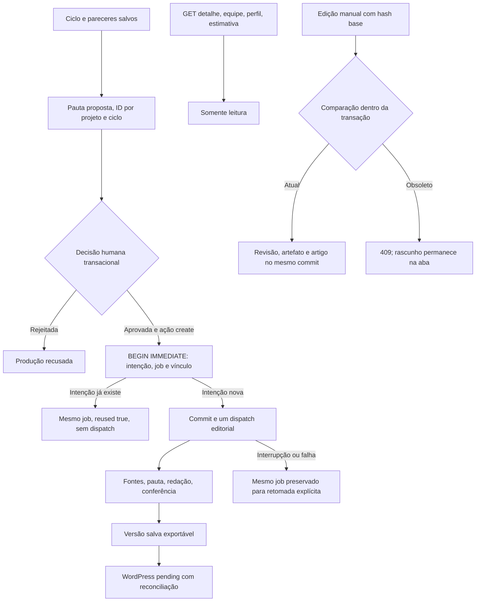

# P0_02 — Consistência arquitetural e segurança operacional

## Referência e escopo

Pacote `PATCH_P0_02_Consistencia_Arquitetural_ORCA/P0_02_Consistencia_Arquitetural`; os seis Markdown correspondem ao manifesto SHA256. O diagnóstico auditado referencia `2ae42d821087631b2c6e2218c4f6b970d69bb737`, app 1.5.22. Este patch parte do P0_01, commit `aedd740270a2343fdafccc3d217f8939bba11bb9`, app 1.5.23, e preserva sua ingestão, proveniência, normalização e exportação. A aplicação passa a 1.5.24; editorial continua em 7, agentes estratégicos em 2, cache `strategy-execution-v2`, contexto `strategy-context-v1`.

Branch `feat/p0-02-architecture-consistency`, sobre `feat/p0-01-source-integrity`. O P0_01 tem [PR #1](https://github.com/Vortex-BR/seo-master-premium/pull/1) ainda separado. A entrega deste patch é código, testes, documentação e PR; não é implantação. Não houve geração paga, transcrição/pesquisa/imagem real, chamada ao WordPress ou alteração de configuração/dados de produção. Os ZIPs preexistentes não foram modificados nem adicionados ao Git.

## Diagnóstico confirmado

Antes das correções, fixtures com rotas reais e SQLite reproduziram sobrescrita de IDs de oportunidade entre escopos, perda de rejeição humana na ressíntese, produção de pauta rejeitada, duas produções para dois POSTs equivalentes, duas edições aceitas sobre a mesma versão e gravações parciais de revisão após falha. O harness executando os handlers JavaScript reproduziu respostas fora de ordem e perda da edição local. A conversão do SDK instalado revelou 13 objetos abertos nos nove schemas estratégicos.

A revisão independente também reproduziu a troca de modelo entre cálculo de identidade e envio da chamada, recibo com modelo relido após a resposta e contagem da tentativa de síntese ainda não persistida no ponto de dispatch. GET de detalhe, estimativa, perfil e equipe gravavam snapshots/ledger em consultas. Todos esses caminhos receberam correções e regressões específicas. Os resultados iniciais de falha ficam identificados como RED, nunca como aceite.

## Fluxo de comandos e leituras

`strategy/store.py` concentra comandos de decisão e criação. A fila serial existente não substitui as transações: testes usam conexões e threads concorrentes. A factory constrói apenas dados e briefing; não executa rede, fila ou chamadas pagas. O dispatch acontece após commit, sob `pipeline.job_lock`, somente para `created=true`. Se o processo cai nesse intervalo, o job `new` permanece recuperável; repetir o POST retorna seu ID, sem retomar ou gerar implicitamente. O comando editorial existente `POST /api/jobs/{id}/generate` permite retomada explícita. Não foi criado um endpoint para duplicar uma intenção mudando apenas uma chave.

`strategy/production.py` transporta pergunta, queries, intenção, público, justificativa, vídeos selecionados/contribuições, evidências estratégicas, limitações, restrições de negócio, notas da curadoria e lacunas/conflitos. O snapshot é dado editorial, nunca fonte factual para o artigo: as transcrições continuam sendo verificadas e citadas pelo fluxo P0_01. URLs substituídas pelo usuário recebem metadados somente quando o vídeo corresponde à curadoria; ausência é registrada. Um vídeo basta. `target_words=null` representa extensão orientada à cobertura, inclusive na redação por seções; o formulário deixa o campo opcional. Metas numéricas explicitamente informadas continuam aceitas e os defaults de clientes antigos são preservados.

## Contratos de API e persistência

| Superfície | Comportamento |
| --- | --- |
| Oportunidade nova da IA | Sempre `proposed`, ainda que a IA devolva `approved`. A ressíntese preserva decisão, conteúdo aprovado, histórico e vínculo existentes. |
| Escopo de ID | `strategy_opportunity_keys`: UNIQUE(project_id, cycle_id, provider_opportunity_id). O ID público legado permanece; colisões entre escopos recebem ID determinístico. IDs repetidos em um lote são recusados antes de persistência parcial. |
| Produção | `strategy_production_intents`: UNIQUE(opportunity_id, operation_key), UNIQUE(job_id). Uma intenção `default` por oportunidade. Repetição retorna `ok`, `job_id`, `intent_id`, `opportunity_id`, `created=false`, `reused=true`. |
| Guardas | Nova produção exige aprovação e ação `create`. Rejeitada/cancelada é recusada; outras ações não criam artigo por terem URL. Vínculo legado válido é adotado sem regravar o job; vínculo ausente/conflitante não cria substituto. |
| Fila | HTTP429 para intenção nova quando cheia, incluindo jobs estratégicos reservados ainda em `new`; duplicatas válidas continuam retornando o mesmo job. |
| GET artigo | Corpo contém `article_hash`; header ETag representa o hash do artigo. Diagnósticos e ledger são projeções de leitura. |
| PUT artigo | `base_article_hash` no corpo ou `If-Match: "<hash>"`. Ausência: 428; hash obsoleto: 409; header inválido/divergente do corpo: 400. Sucesso retorna `ok` e `article_hash`. |
| Transação de edição | `db.job_transaction()` usa BEGIN IMMEDIATE e conexão local ao contexto. Revisão anterior, arquivo de auditoria, invalidação e atualização do job confirmam juntos; falha desfaz todos. Sem rede nesta transação. |

A migração adiciona duas tabelas e índices, preenchendo somente a tabela de identidade a partir das colunas antigas. `opportunities` mantém suas sete colunas, compatíveis com o INSERT posicional anterior. Não há down-migration, remoção de histórico, reescrita de jobs ou coerção de dados desconhecidos. A migração repetida, backup SQLite consistente e restauração são testados em banco temporário.

## Schemas e cache

Os campos estratégicos `list[dict]` receberam modelos fechados com tipos e validação. Métricas e disponibilidade desconhecidas são `null`; zero observado permanece zero. Números negativos/inválidos, booleanos como contagem, NaN e infinito são recusados onde aplicável. Aliases históricos `from`/`to` são preservados. Leitura de runs antigas mantém campos históricos; execução nova valida o contrato.

A sonda usa `generation.prepare_structured()` e o helper da mesma versão do SDK empregado em runtime, incluindo 20 schemas editoriais gerados com IDs, trechos e referências locais. Objetos precisam de `additionalProperties=false` e todas as propriedades em `required`; nulabilidade representa ausência. A regra está documentada em [Structured Outputs](https://developers.openai.com/api/docs/guides/structured-outputs). A verificação é estrutural e offline; aceitação pelo provedor em uma chamada real não foi testada.

`agents.prepare_execution()` prepara uma única requisição. A identidade contém escopo, modelo efetivo, hash do prompt/instruções, schema do SDK, contexto, versões e configuração efetiva. A mesma requisição é enviada por `generation.structured(prepared=...)`, e o recibo usa seu modelo. Não persiste chaves ou contexto bruto na identidade. A tentativa de síntese é salva antes do dispatch, preservando o limite de chamadas após interrupção.

Antes de retomar um ciclo, o engine verifica todos os resultados concluídos, seus contratos, dependências e identidades. Run legada sem identidade, saída incompleta ou configuração incompatível gera erro recuperável antes de novas chamadas. O histórico continua legível/exportável; reexecução exige um novo ciclo explícito. Não há migração silenciosa de resultados antigos para o cache atual.

## Interface e concorrência

Os quatro JS modificados guardam navegação, job, aba, renderização e ordem de requests. Uma mutação invalida consultas anteriores; o scheduler mantém no máximo um polling pendente por navegação. Respostas ou erros atrasados não substituem outra tela. O editor captura o hash exibido, conserva todos os campos em 409/428 e oferece download JSON local e carregamento da versão salva mediante confirmação. Digitação durante save/reload permanece local. Briefing, transcrição, perfil, planejamento e imagens têm controle de alterações por formulário; salvar um formulário não descarta outro ainda editado. Respostas de falha de geração não repintam um editor com alterações.

## Custo incremental medido

Nenhuma nova etapa paga foi adicionada. Chamadas pagas e dispatchs reais nas sondas: zero. O teste de rota repetida observa um dispatch simulado; a medição concorrente de persistência observa uma factory, um job e uma intenção em 32 pedidos. Isso demonstra prevenção de duplicação local, não uma economia em dólares observada em produção.

Em SQLite temporário e payloads sintéticos pequenos, oito intenções em 32 pedidos sequenciais tiveram criação mediana de 53,9278 ms e reuso de 2,2615 ms. O payload por intenção teve média de 523 bytes para job, 316 para intenção e 289 de aumento no JSON da oportunidade. Os 1.128 bytes somados não incluem índices, páginas, WAL ou transcrições reais. A alocação SQLite está registrada separadamente na sonda. A identidade ocupa aproximadamente 525–531 bytes; schemas fechados aumentam o schema enviado em alguns papéis, conforme bytes medidos. Bytes não são tokens nem fatura. Tempos de máquina Windows compartilhada não representam latência de produção.

O ledger conserva reservas/estimativas e limite vitalício existentes; leitura pura calcula valores históricos sem importá-los. A importação durável continua nos comandos financeiros, antes de reservar nova chamada. Não foi observado o preço real por artigo em produção nesta execução.

## Limites e riscos restantes

- Uvicorn/Docker continuam com um processo. Unicidade SQL cobre conexões concorrentes; locks de executor, imagens, decisões editoriais e WordPress não constituem um protocolo de coordenação distribuída entre réplicas. Não foi habilitada execução multiworker.
- O envio WordPress continua sob a trava existente durante rede. Preservar suas guardas de edição/reconciliação foi prioritário; retirar essa trava exige protocolo durável próprio e ficou como trabalho posterior.
- `project_id` organiza estratégia; o acesso segue a autenticação administrativa global. Não é isolamento multitenant.
- Limites estratégicos declarados de tokens, pesquisas e lookups não têm enforcement observado. O limite de tentativas e o ledger existentes não equivalem a essas três métricas.
- O estado da oportunidade não acompanha automaticamente a conclusão/cancelamento do job. O vínculo persistente permite consultar o job; não foi implementada sincronização adicional de estados.
- Criação genérica via `/api/jobs` tem guarda contra duplo submit na mesma form, mas não ganhou idempotência persistente para resposta perdida de POST. A garantia deste patch é a produção por oportunidade.
- Texto local em conflito permanece na aba; fechar ou sofrer crash antes de baixar/copiar pode perdê-lo. Não foi criado armazenamento permanente de rascunho nem importador JSON.
- Não foram feitos E2E visual em navegador, smoke de produção, geração real ou WordPress real. Não há alegação de fidelidade factual de artigos novos baseada apenas em mocks.

## Operação e rollback

Os controles são parte dos contratos, sem feature flag que desligue aprovação, idempotência ou versão base. Atualize servidor e JS juntos; clientes antigos sem base recebem 428, preservando dados em vez de sobrescrevê-los. O contrato P0_01 e sua flag de agregação permanecem intactos.

Antes de futura implantação, use backup consistente SQLite via API de backup (inclui estado confirmado em WAL), mídia e chaves de cifragem sob guarda segura; segredos não pertencem a evidências de entrega. A restauração foi exercitada apenas em fixtures locais. Acompanhe conflitos 409/428, duplicatas `reused`, fila, checkpoints incompatíveis e custos do ledger após deploy autorizado.

O retorno ao P0_01 mantém compatibilidade estrutural das sete colunas, mas **não garante compatibilidade de execução**: jobs novos com `target_words=null` e os contratos/cache novos podem exigir o código P0_02. Prefira corrigir adiante. Se um rollback completo for necessário, suspenda gravações/gerações, restaure o conjunto consistente de código, banco e mídia do backup anterior e atualize os clientes. Guarde separadamente trabalhos produzidos depois do backup; restaurá-lo pode descartá-los. Não normalize `null` para uma meta artificial de palavras. Reverter Git não reverte dados nem cancela uma chamada já enviada.

O fluxo de integração usa PR baseado na branch P0_01, evitando levar o patch anterior como alteração nova. Depois de integrar o PR #1, o PR P0_02 pode ser redirecionado para `main`. Merge/deploy e smoke pagos não foram executados por este patch. Resultados e comandos de aceite estão em [p0-02-consistencia-arquitetural-aceite.md](p0-02-consistencia-arquitetural-aceite.md).
