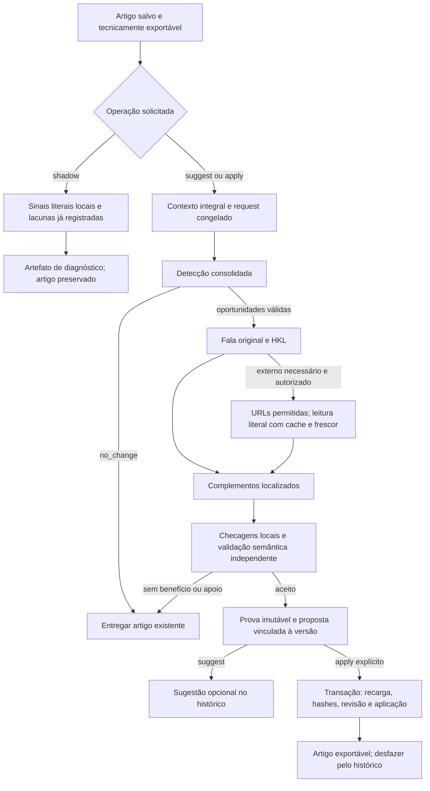

# P2_01 — Inteligência Editorial Crítica

A IEC acrescenta leitura crítica opcional ao artigo salvo, procurando explicações curtas que ajudem a responder à pergunta do leitor. A geração normal continua com extração, pauta, redação completa e revisão factual. A configuração padrão acrescenta somente um diagnóstico local sem IA paga, pesquisa ou alteração do artigo. Sugestões semânticas e aplicação são operações explícitas, com orçamento próprio e sujeitas ao limite financeiro acumulado do artigo.

Esta documentação descreve o código do checkout, não uma implantação confirmada em produção. A avaliação humana de qualidade, os custos de novas gerações reais e o benchmark editorial cego continuam pendentes.

## Identidade e evidências

| Item | Identificação |
|---|---|
| Pacote executado | `PATCH_P2_01_Inteligencia_Editorial_Critica_ORCA/P2_01_Inteligencia_Editorial_Critica` |
| Base efetiva do checkout | `49a1f3e92ece84ae2d7f9ae84e426341a7ab05cb`, app `1.5.26` |
| Versão implementada no checkout | app `1.5.27`; IEC `1`; política `iec.policy.v1` |
| Contratos básicos preservados | editorial `7`, agentes `7`, fluxo de evidências `2`; HKL `human_knowledge.v1` |
| Integridade do pacote | [package-integrity.json](evidencias/p2-01/package-integrity.json) |
| Comparação de contexto do request | [request-context-comparison.json](evidencias/p2-01/request-context-comparison.json) |
| Aceite e comandos | [p2-01-editorial-intelligence-aceite.md](p2-01-editorial-intelligence-aceite.md) |
| Resultado final de testes e CI | O recibo de validação da entrega deve registrar o commit verificado e o run correspondente; resultados pendentes não equivalem a aprovação. |

A referência de auditoria do pacote é anterior: commit `2ae42d821087631b2c6e2218c4f6b970d69bb737`, app `1.5.22`. A implementação foi adaptada aos patches P0_01, P0_02, P1_01 e P1_02 já presentes no checkout. A estimativa histórica de tokens citada naquela auditoria não é custo observado por artigo desta versão.

As evidências públicas identificam código, contratos e testes. Não incluem banco de produção, segredos, cookies, áudio ou transcrições privadas. Fixtures sintéticas verificam comportamento de engenharia; não certificam fidelidade semântica de vídeos reais.

## Auditoria de integração e decisão arquitetural

O fluxo real está em `pipeline._run` → `engine.run` → `workflow.extract/plan/write/factual_review`. Os ciclos Video-First delegam a `video_first.py`, e a redação integral usa `composition.write`. As quatro entregas básicas continuam utilizando os mesmos contratos e políticas.

| Superfície | Comportamento encontrado e reutilização |
|---|---|
| `video_first.extract` | Extrai a fala com IDs originais; conserva `source_spoken_insight`, analogias, dicas, alertas e lacunas. |
| `video_first.plan` e `composition.write` | Planejam e compõem a base exclusivamente com os vídeos; o enriquecimento não promove pesquisa antiga nem modifica essa apuração. |
| `generation.prepare_structured` | Prepara o request completo e seu esquema antes da chamada. Só estágios `iec_` ou a revisão IEC explicitamente identificada recebem a política complementar. |
| `generation.resolve_evidence` | Recupera segmentos e cues originais; ambiguidades, fontes internas e IDs inexistentes não viram apoio. |
| `human_knowledge.project/compact` | Fornecem conhecimento tipado e referências de origem sem tratar candidatos lexicais, rótulos legados ou `unknown` como verdade. |
| `research.page_text` | Leitura HTTPS de domínio público, DNS verificado e pinado, validação TLS, sem redirects e com limites de tempo/tamanho. |
| `store.artifact/save_run/save_changes` | Artefatos imutáveis, cache de requests concluídos, prova da proposta e histórico de alterações. |
| `spending.create_response/reserve/finish` | Reserva antes do envio, uso contabilizado, preços identificados e retenção de cobranças incertas. |
| `db.job_transaction`, `changes.preview/decide` | Transação com recarga do estado atual, comparação de versão, alterações em blocos únicos e revisões reversíveis. |
| `delivery.ensure_exportable`, `publishing`, `wordpress` | Disponibilidade técnica, rendering, exportação, envio `pending` e proteção contra edição externa. |

A IEC foi implementada como operação separada sobre um artigo pronto. Chamadas opcionais podem durar ou falhar e o usuário pode editar o artigo nesse intervalo. Executá-las fora de `engine.run` evita que um save posterior do pipeline persista um snapshot antigo. A operação usa cópia privada do contexto e mescla somente telemetria de consumo, recarregando o job atual em transação.

Foram reutilizados o ledger, armazenamento de agentes e artefatos, HKL, leitor HTTP, preview de alterações e transações. Não há cinco novos serviços/modelos obrigatórios, banco paralelo ou migração destrutiva. O modelo da operação é congelado a partir da configuração existente, sem escolher silenciosamente um modelo adicional.

## Fluxos disponíveis

### Shadow automático e solicitação local

`pipeline.run` chama `intelligence_runtime.observe` no `finally`, usando o job recarregado. `EDITORIAL_INTELLIGENCE_MODE=shadow` é o padrão; `off` interrompe novas observações e operações IEC. Valores desconhecidos da flag falham para `off`.

`intelligence.shadow` localiza somente sinais textuais explícitos e conserva lacunas já registradas. O resultado informa `semantic_verification=not_performed`, `provider_calls=0`, `article_modified=false` e `export_blocking=false`. `no_change` nessa modalidade significa ausência de sinal literal detectado, não uma certificação de que o artigo está completo.

O artefato `editorial_intelligence` é independente do job editorial e não é enviado às quatro chamadas básicas. O evento de observabilidade registra zero custo incremental de IA; CPU, armazenamento e infraestrutura não recebem preço inventado. Falhas ordinárias do diagnóstico registram somente a classe do erro e preservam a exportação. Cancelamento não é convertido em sucesso.

### Operação ativa

`intelligence_runtime.execute` exige artigo tecnicamente válido, hash atual, ausência de geração incompatível em andamento e orçamento incremental positivo. A detecção recebe artigo inteiro, blocos literais exaustivos, pauta, plano, versões, originais e HKL. Não usa um resumo truncado como substituto do artigo.

Uma análise ativa de artigo já claro necessita apenas da detecção; não chama composição, revisão de propostas ou pesquisa. Esse request explicitamente solicitado pode ter custo. Na repetição do mesmo contexto, requests concluídos são reutilizados. Shadow não faz essa chamada.

Para oportunidades úteis, a composição gera apenas `addition`, normalmente uma a três frases quando suficiente. O servidor anexa o complemento a um parágrafo único, sem reescrever o artigo. A proposta não pode selecionar bloco inexistente, cabeçalho, bloco repetido ou conteúdo sobreposto. A verificação local procura duplicação no artigo inteiro, incluindo explicações posteriores e outras propostas do lote.

`prepare_proposals` produz candidatos, não aprovações. O terceiro estágio semântico examina o antes/depois integral e as fontes. Uma aprovação exige seis critérios positivos: precisão, atribuição, ausência de contradição, ausência de redundância, coesão e utilidade. A revisão deve cobrir exatamente os candidatos recebidos; `reject` e `uncertain` não alteram o artigo.

Em condições usuais, o caminho ativo utiliza uma detecção ou três chamadas — detecção, composição e validação — sem descoberta externa. Descoberta consolidada de URLs acrescenta uma chamada quando necessária, autorizada e comportada pelos limites. Não existe chamada por parágrafo nem pesquisa indiscriminada. Orçamento/chamadas insuficientes preservam o artigo salvo.

O contexto IEC não repete a transcrição pelo transporte legado `fontes_para_conferencia`: os originais integrais já estão em `original_videos`. A comparação offline da fixture sintética de três segmentos removeu 538 caracteres redundantes de input em cada estágio, preservando exatamente as fontes originais, demais materiais, instruções e esquema. O [recibo de comparação](evidencias/p2-01/request-context-comparison.json) registra hashes e valores; caracteres não equivalem a tokens medidos, custo real ou melhora de qualidade. Foundations necessárias à composição e validação continuam disponíveis.

## API e interface

Os endpoints autenticados são:

| Operação | Endpoint |
|---|---|
| Consultar última análise e histórico | `GET /api/jobs/{id}/editorial-intelligence` |
| Solicitar shadow, sugestão ou aplicação explícita | `POST /api/jobs/{id}/editorial-intelligence` |
| Aplicar, rejeitar ou desfazer proposta | `POST /api/jobs/{id}/changes/{change_id}` |
| Consultar artefatos de prova e contexto | `GET /api/jobs/{id}/artifacts?kind=iec_proof`, além dos demais tipos |

`IECRequest` contém `article_hash`, `mode` (`shadow`, `suggest`, `apply`), `budget_usd`, `max_calls`, `max_output_tokens`, `allow_external`, `external_urls`, `trusted_domains` e `freshness_hours`.

| Controle | Contrato |
|---|---|
| Orçamento | Decimal finito e não negativo; positivo em `suggest/apply`; padrão zero para shadow. |
| Limite de chamadas | Inteiro entre 1 e 6; padrão 3. |
| Saída por request | Inteiro entre 256 e 8.000 tokens; padrão 2.000. |
| Fontes externas | Desabilitadas por padrão; até seis URLs explícitas e vinte domínios confiáveis. |
| Frescor | Inteiro entre 1 e 720 horas; padrão 24. |

URLs exigem HTTPS público, ausência de credenciais e porta alternativa e correspondência exata ou subdomínio com limite de ponto na lista autorizada. URLs externas exigem `allow_external=true`; autorização externa exige domínios explícitos. Formato inválido é recusado antes da operação paga.

No frontend, `editorial.js` apresenta “Analisar clareza” para shadow gratuito e “Gerar sugestões com IA” com orçamento informado pelo usuário. Pesquisa com referências complementares é uma opção explícita. Aplicação e undo usam o histórico existente. Respostas pertencentes a outro artigo ou versão não substituem o resultado exibido; chamadas duplicadas da interface são evitadas. As mensagens e valores exibidos são escapados e custos desconhecidos aparecem como não medidos.

## Origem e prova das explicações

`video_foundations` resolve a fala original e conserva ID de referência, segmento de citação, vídeo, texto literal, hash do registro, hash da fonte completa e tempo original. Alterar metadados, cues ou transcrição invalida a base anterior. Cues são recuperados pelo próprio ID, mas a citação publicada aponta ao segmento pai. Timestamps são derivados do original; a ausência de tempo não é preenchida por suposição.

`intelligence_research.read_pages` lê somente destinos autorizados. O cache positivo conserva texto e metadados de recuperação por TTL configurado; falhas têm cache negativo curto, de até cinco minutos. Mudança de domínio autorizado, política ou frescor invalida o reaproveitamento. Uma página indisponível retorna ausência de fundamento, não uma explicação inventada. DNS privado, credenciais, portas indevidas e redirecionamentos são recusados pelo caminho de leitura.

O registro externo contém URL, publisher como domínio efetivamente acessado, `fetched_at`, `expires_at`, hash do conteúdo, hash do registro e limitações. Publisher não é credencial humana ou garantia de autoridade. O rótulo `external_verified` indica origem lida e ancorável; a verificação semântica ainda deve demonstrar apoio às afirmações. Não prova consenso, verdade universal ou autorização para reproduzir integralmente terceiros.

Cada support contém `reference_id`, `excerpt`, `offset_start` e `offset_end`. O servidor confere igualdade literal, posição, hash e origem. Não aceita citação montada pela junção de partes distantes. Pesquisa histórica `rn`, páginas antigas de bastidor e `agent_background_knowledge` continuam internos e não são promovidos como evidências IEC.

Complementos de vídeo recebem citação `[[segmento]]` e tempo original quando disponível. Complementos externos recebem hyperlink Markdown “Fonte complementar”, criado pelo servidor a partir da URL validada. O modelo não pode inserir links, citações, timestamps, HTML ou novos blocos na addition. Informação externa não recebe citação de vídeo e não pode ser atribuída ao apresentador.

Experiência, opinião e analogia conservam sua natureza e atribuição. Hipótese sem apoio é rejeitada; primeira pessoa inventada, quantidade ausente da evidência selecionada e perda de condição explícita também são recusadas. Essas checagens determinísticas são conservadoras e incompletas; não substituem análise semântica ou avaliação humana.

## Revisão e entrega de artigo enriquecido

`workflow.factual_review` identifica complementos efetivamente aplicados e encaminha a revisão para `intelligence_review`. Esse contrato recebe artigo completo e foundations de origens separadas. O fato externo pode ser sustentado pela fonte complementar sem precisar existir no vídeo; não pode ser convertido em testemunho do criador. Aprovação anterior e presença de link não constituem prova suficiente.

Só propostas aplicadas, com prova imutável válida e complemento ainda presente no artigo, entram nesse contexto. Fonte vencida ou adulterada fica indisponível para sustentar uma aprovação; a revisão deve registrar incerteza. Uma nova revisão semântica continua sendo operação paga do usuário, sujeita ao ledger existente.

O inventário `generation.evidence_map` continua estritamente de vídeo. Referências externas são hyperlinks próprios, preservados pelo renderer Markdown existente, inclusive HTML e WXR. `deterministic_findings` reconhece hyperlinks complementares associados a fontes de propostas aplicadas com prova válida; links arbitrários continuam gerando diagnóstico de rastreabilidade. A observação não veta exportação nem certifica o significado da afirmação citada.

A revisão enriquecida conserva apontamentos de cobertura, direção editorial e pendências essenciais. Incerteza de áudio também considera os IDs efetivamente citados no artigo, mesmo quando o revisor não os declarou como apoio; a presença de um complemento externo não apaga a dúvida da fala original.

`delivery.ensure_exportable` continua sendo a proteção técnica. Alertas, revisão pendente, ausência de complemento, orçamento ou serviço IEC indisponível não impedem exportar artigo válido. O envio WordPress conserva `pending`, reconciliação de timeout e proteção contra conteúdo modificado externamente. Nenhuma publicação real foi necessária para os testes.

## Concorrência, cache, histórico e desfazer

O fingerprint inclui request serializado, esquema, políticas, modelo congelado, artigo, contexto e opções de pesquisa/frescor. Budget e limite de chamadas são controles de operação; aumentar esses controles na retomada não apaga gastos anteriores nem invalida automaticamente uma entrega paga válida.

`_claim` serializa operações IEC do mesmo artigo; `_structured` também reclama o request antes do despacho. Operação existente em andamento devolve estado `running`, sem novo envio duplicado. Checkpoints concluídos são reutilizados após interrupção. Não existe retry pago oculto em loop.

Um resultado concluído não estende o TTL de uma página complementar. Antes de reutilizar propostas pendentes, `_expired_proofs` confere o vencimento das fontes selecionadas. Nova solicitação com fonte vencida cria uma execução de atualização, relê a página e exige composição e validação para a nova foundation; a detecção integral pode continuar reutilizada quando seu request permanece idêntico. A nova execução compartilha o namespace financeiro da solicitação original, incluindo gastos e reservas anteriores. As provas e propostas antigas permanecem no histórico, e seu apply continua recusando fontes vencidas. Repetir a solicitação após a atualização reutiliza o resultado novo enquanto ele permanece válido.

O contexto pinado inclui briefing, fontes integrais, conteúdo/versão do plano e versão da apuração. Estado mutável de revisão, chamadas e `plan.valid` não substitui essa identidade. As provas são artefatos imutáveis `iec_proof`; foundations e relatórios ficam em `iec_foundations`, `iec_external_source` e `editorial_intelligence`.

`changes.decide` recarrega artigo e proposta em `db.job_transaction`, com `BEGIN IMMEDIATE`. Antes de aplicar, compara hash atual, status da proposta, contexto, prova, resultado esperado, apoios literais e aprovação semântica; fontes externas selecionadas precisam estar dentro do prazo de validade. A revisão anterior, artigo anterior, alteração e estado do job são persistidos atomicamente. Uma edição concorrente não é sobrescrita pelo snapshot da análise.

Undo exige que o artigo atual seja exatamente o resultado aplicado e que a versão anterior preservada corresponda ao hash registrado. Se houve edição posterior, não substitui essa edição silenciosamente; a revisão salva permite recuperação manual deliberada. Desfazer não apaga custos pagos, tentativas ou fontes de auditoria.

## Controle financeiro e métricas

`spending.incremental_budget` cria sublimitador no mesmo `job_id`, identificado pelo namespace da solicitação IEC original. Uma execução criada para atualizar fontes vencidas conserva esse namespace. `reserve` verifica saldo incremental e saldo acumulado do artigo na mesma transação de escrita. Operações concorrentes, snapshots antigos e atualização do cache não concedem limite financeiro adicional. Mudança de namespace não renova o teto total do artigo.

Cada despacho conserva namespace, preço utilizado, reserva, tokens, resposta e estado. Timeout, cancelamento ou confirmação incompleta preservam reserva inconclusiva até reconciliação fundamentada. Falha não demonstra ausência de cobrança. Requests recusados antes de envio não são faturados pela aplicação. Pesquisa IEC autorizada usa sua parcela explícita, sem remover o limite geral do artigo; a regra histórica de pesquisa fora da IEC permanece.

O relatório separa contabilizado, reservado, calculado, estimado e registrado quando disponíveis. Custo calculado por melhoria semanticamente aceita e por melhoria aplicada usa denominador observado; denominador zero ou total desconhecido resulta em `null`. Fatura do provedor, infraestrutura e avaliação humana permanecem desconhecidas sem dados próprios.

Ao atualizar fontes, o custo exibido acumula os despachos do mesmo namespace, inclusive versões anteriores, e os contadores de melhorias descrevem a proposta da execução exibida. O limite de chamadas vale para a execução dessa versão; uma retomada após timeout conserva seu contador, enquanto a atualização explícita de uma fonte exige novas entregas dentro do saldo financeiro acumulado.

Os testes usam uso simulado não zero para verificar somas, reservas e limites. Esses valores comprovam comportamento contábil sob fixtures e não o preço real do modelo, de um artigo novo ou uma economia comprovada em produção. Shadow registra zero somente para operações adicionais de IA que não ocorreram, sem declarar infraestrutura gratuita.

## Operação e rollback

Não há alteração destrutiva de esquema nem backfill obrigatório dos artigos antigos. Novos registros usam as tabelas existentes de agentes, propostas, artefatos e ledger. GET, exportação e shadow não exigem regeneração paga de artigos legados.

Para interromper a IEC, configure `EDITORIAL_INTELLIGENCE_MODE=off` e reinicie o serviço. Isso encerra novas observações/solicitações, preservando artigos, provas e histórico já salvos. A flag não desfaz um complemento aplicado nem apaga cobranças. Para remover um complemento, use o undo versionado quando a versão permitir; preserve revisões e ledger.

Uma reversão completa de código exige revisar compatibilidade dos registros IEC e hyperlinks já salvos. `git revert` não equivale a reversão dos dados. Antes de atualização operacional, o responsável deve manter backup consistente de SQLite/WAL, mídias e material de cifragem em armazenamento privado, fora da documentação pública.

A aplicação atual é operada com um worker. No startup, recuperação financeira preserva cobranças incertas e `intelligence_runtime.recover` marca operações IEC em andamento como interrompidas, permitindo retomada dos checkpoints concluídos. Esse procedimento pressupõe reinício integral do worker; escalar múltiplos processos sem lease/heartbeat pode marcar trabalho de outro processo como interrompido. Não é autorização para aumentar o número de workers.

Esta entrega não realiza deploy, acesso mutável à produção, chamada paga real ou publicação WordPress real. O estado de branch/PR e CI deve ser registrado no recibo da entrega final.

## Verificações ainda pendentes

- Benchmark pareado A/B de artigos reais da mesma fonte, com avaliadores humanos cegos, rubrica definida, custos observados e IDs de versão.
- Taxa real de falsos positivos, utilidade, concisão, coesão, atribuição e melhorias aceitas/rejeitadas em diversidade de temas.
- Custo efetivo por artigo e complemento, fatura, tempo de modelo/pesquisa e custo de infraestrutura em ambiente autorizado.
- Smoke test de deploy e publicação WordPress em staging autorizado; os testes atuais usam transporte simulado.
- Avaliação de fontes específicas, atualidade temática, licenças e necessidade de revisão especializada para afirmações de alto impacto.
- Operação em múltiplos workers exige tratamento de ownership/leases e testes de recuperação distribuída antes de rollout.

Uma única fonte de vídeo é suficiente para gerar e analisar um artigo. Não se impõe uma amostra mínima de doze vídeos para uso do produto. O benchmark humano exige planejamento e autorização próprios; sua ausência é declarada, não substituída por pontuação do modelo ou aumento de contagem de palavras.

## Estado da entrega

Branch `feat/p2-01-editorial-intelligence`, [PR #5](https://github.com/Vortex-BR/seo-master-premium/pull/5),
app `1.5.27`. Os 201 testes IEC passaram juntos localmente. O [CI do código](https://github.com/Vortex-BR/seo-master-premium/actions/runs/38070988349) aprovou 1.242 testes Python,
73 Node, cinco checks de sintaxe e o build Docker. O [recibo](evidencias/p2-01/validation.json)
vincula comandos, casos, hashes e o commit de código; checks do PR identificam a entrega final.
O modo padrão é `shadow`; não houve merge em `main`, deploy ou operação paga real.
