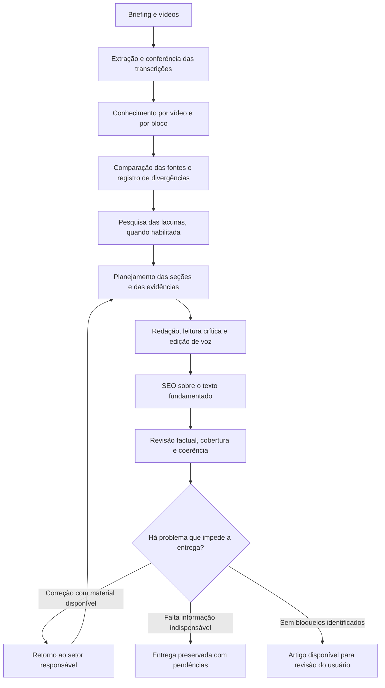

# Planejamento de melhoria da extração e da redação

**Situação:** proposta para revisão do usuário, baseada no código atual em 7 de outubro de 2026.

**Objetivo:** transformar até cinco vídeos sobre um assunto em um artigo fiel às
fontes, com planejamento rastreável, parágrafos contextualizados e início,
desenvolvimento e fechamento compreensíveis. Aumentar o volume de material deve
aumentar a organização e a conferência, sem transformar divergências em certezas.

Este documento planeja mudanças futuras. As regras de contexto dos parágrafos já
foram adicionadas aos prompts; isso não significa que a arquitetura de extração
individual, comparação e cobertura descrita abaixo já esteja implementada.

## 1. O que existe e o que será desenvolvido

| Área | Situação atual | Mudança proposta |
| --- | --- | --- |
| Entrada | Até cinco links; 120 mil caracteres por vídeo e 180 mil no conjunto | Manter os limites iniciais e organizar o processamento por vídeo e por bloco |
| Extração | Legendas, alternativa Supadata e áudio opcional; trechos identificados e timestamps quando disponíveis | Conferir completude, registrar limitações e preservar o contexto dos trechos |
| Apuração | Uma análise inicial recebe as transcrições reunidas | Extrair e conferir cada vídeo antes de comparar as fontes |
| Divergências | Há instruções que forçam a conciliação de prazos diferentes | Resolver apenas relações sustentadas; preservar discordâncias e métodos distintos |
| Planejamento | Dossiê com afirmações e lista de títulos | Plano de seções com finalidade, informações, evidências e continuidade |
| Redação | Redator, leitor crítico e editor de voz | Usar o plano e conferir cobertura, contexto e progressão do texto |
| Coerência | Instruções de contexto dos parágrafos e início, meio e fim já atualizadas | Avaliar o comportamento com exemplos reais e critérios observáveis |
| Revisão | Revisão por IA e validação de IDs, citações, versões e alguns números | Conferir significado, unidades, condições, atribuições e cobertura das afirmações |
| Coordenação | Doze papéis, fila sequencial, entregas persistidas e correções limitadas | Compartilhar artefatos versionados, decisões e pendências entre todos os setores |
| Interface | Fontes, equipe, revisão e histórico | Exibir comparação, planejamento, participação das fontes e limitações |

## 2. Fluxo completo proposto

Cada retorno executa somente as etapas afetadas. A seta de retorno ao planejamento
representa a reconciliação das dependências; uma mudança localizada de estilo não
exige repetir toda a apuração.

## 3. Entrada, briefing e limites

O briefing deve definir tema, pergunta principal, público, intenção, gênero,
palavra-chave, voz, exclusões e extensão aproximada. Quando o editor não preencher
uma pergunta principal, o planejador deve explicitá-la usando o tema e as fontes,
sem substituir a direção solicitada por outro assunto.

O escopo inicial permanece em um a cinco vídeos. Quatro vídeos curtos podem conter
menos informação do que um vídeo longo; o dimensionamento deve considerar texto,
complexidade, quantidade de afirmações e divergências, além do número de links.

Os limites atuais de tamanho permanecem até a validação do novo processamento.
Material acima dos limites é identificado antes da redação, sem cortes silenciosos.
Uma ampliação para seis ou mais vídeos será uma decisão posterior, acompanhada de
testes de fidelidade, custo e tempo de execução.

## 4. Extração e qualidade das transcrições

A obtenção continua aproveitando legendas e as alternativas já configuradas. Para
cada fonte, registrar vídeo, título, autor, idioma, provedor, data, situação da
extração e disponibilidade dos timestamps. Registrar se a legenda é automática
quando o provedor fornecer esse dado; ausência dessa informação não deve ser
substituída por uma classificação inventada.

Conferir entradas vazias, duplicações de legendas, timestamps fora de ordem,
interrupções detectáveis e trechos possivelmente corrompidos. Falas ambíguas,
números ou termos técnicos suspeitos geram pedidos de conferência, sem correção
silenciosa por adivinhação. Uma transcrição não será considerada completa apenas
porque contém bastante texto.

Dividir transcrições longas em blocos que respeitem frases e unidades de explicação,
com uma faixa de contexto antes e depois quando necessária. A sobreposição fornece
contexto; as informações repetidas são deduplicadas na consolidação. Cada bloco
fica associado aos trechos originais, sem alterar o texto utilizado como evidência.

O orçamento deve considerar os limites do modelo configurado e reservar espaço
para instruções e resposta. O tamanho dos blocos será ajustado por avaliação, não
definido exclusivamente por uma quantidade fixa de caracteres.

Nesta primeira entrega, a análise continua textual. Quadros, gráficos e
demonstrações visuais podem ser incluídos em uma etapa posterior, com origem e
timestamp próprios. Informação vista apenas na tela não será tratada como extraída
da transcrição.

## 5. Conhecimento extraído de cada vídeo

O extrator analisa cada vídeo, por blocos quando necessário, antes da síntese entre
fontes. A consolidação de um vídeo conserva informações únicas e relações entre
trechos distantes, como uma ressalva apresentada depois do procedimento.

Cada informação deve registrar:

- Identificador e assunto a que pertence.
- Afirmação ou explicação extraída.
- Natureza: informação factual apresentada pela fonte, opinião ou experiência individual.
- Método, situação e condições de aplicação, quando mencionados.
- Valores, unidades, intervalos e restrições, quando presentes.
- Evidência literal, trecho de origem e timestamp disponível.
- Limitações e situação da conferência.

Além das afirmações, extrair procedimentos, conceitos, exemplos, comparações,
ressalvas e perguntas que ficaram abertas. Os dados não serão reduzidos a um
resumo genérico que apague as condições necessárias para compreender uma explicação.

O checador compara o material extraído com os trechos originais e seu contexto.
Um trecho realmente existente pode não sustentar a conclusão atribuída a ele.
Conferir essa relação exige avaliação de significado, além da verificação por código.

## 6. Comparação e tratamento de divergências

Organizar uma matriz por assunto, com as informações de cada vídeo, suas condições,
evidências e contribuição para a pauta. Classificar as relações como complementação,
repetição, concordância nas mesmas condições, diferença de método, divergência ou
informação insuficiente para comparar.

Não tratar a repetição da mesma origem em vários vídeos como confirmação
independente. Não misturar valores de métodos distintos, mudar unidades nem
transformar uma experiência particular em regra geral.

Remover as instruções atuais de conciliação obrigatória em todos os pontos em que
aparecem: regras compartilhadas, extração, planejamento, redação, edição e revisão.
Também remover os exemplos que oferecem uma explicação factual pronta sem exigir
evidência para ela.

**Exemplo hipotético:** um vídeo recomenda três horas e outro recomenda 24 horas.
Antes de escrever, verificar se falam do mesmo método, da mesma etapa e das mesmas
condições. A relação entre esses tempos só pode ser explicada se houver suporte.
Se houver discordância real, mantê-la explícita. Não inventar que um valor é o ideal
e outro é um limite máximo para produzir um texto aparentemente harmonioso.

Uma divergência pode ser tratada com pesquisa, apresentação de alternativas com
atribuição, exclusão justificada de uma afirmação sem apoio ou registro de uma
pendência indispensável. O registro deve conservar a evidência e a decisão adotada.

## 7. Pesquisa complementar

Pesquisar questões específicas surgidas da apuração: dados ausentes, parâmetros
contraditórios, termos ambíguos ou afirmações que exigem atualização. Priorizar fontes
primárias pertinentes ao assunto e guardar o trecho que sustenta a informação,
com URL e data de consulta.

Uma nota produzida pela IA a partir da pesquisa não substitui a conferência da
fonte citada. Registrar limitações de acesso e situações em que só foi possível
obter uma referência parcial.

A pesquisa continua respeitando a escolha do editor. Se estiver desativada ou não
resolver uma lacuna, a redação não completa o dado de memória. O fluxo preserva a
limitação e decide se pode escrever com o material disponível.

O orçamento de pesquisa deve ser configurável e vinculado aos pedidos registrados.
O limite atual de duas chamadas de ferramenta por execução não será apresentado
como garantia de resolução de todas as divergências.

## 8. Planejamento editorial antes da redação

O planejador recebe conhecimento conferido, comparação entre fontes, pesquisa,
direção editorial e pendências. Entrega uma estrutura em que cada seção registra:

| Campo | Finalidade |
| --- | --- |
| Título sugerido e posição | Definir o assunto e a ordem da seção |
| Pergunta respondida | Explicar a utilidade para o leitor |
| Informações e evidências | Delimitar o que pode ser desenvolvido |
| Conceitos necessários | Identificar o que precisa ter sido explicado antes |
| Condições e ressalvas | Preservar limites e diferenças entre métodos |
| Ligação com as seções vizinhas | Manter continuidade de compreensão |
| Contribuição das fontes | Mostrar quais vídeos sustentam a seção |
| Pendências e exclusões | Registrar o que não pode ser afirmado |

A estrutura acompanha o gênero e a pergunta do leitor. Comparações, dúvidas,
alertas e retomadas breves podem ser úteis; devem ser avaliadas pela sua finalidade,
sem proibições absolutas que impeçam uma organização adequada.

O início situa o tema e apresenta a pergunta. O desenvolvimento constrói a resposta
com as explicações necessárias. O fechamento encerra o raciocínio com uma resposta,
limitação ou orientação sustentada pelo texto. Não exige títulos fixos nem uma
conclusão que reescreva todas as seções.

O usuário poderá visualizar e ajustar o plano. A consulta ao plano não executa
redação por si só; o fluxo automático permanece uma opção do perfil editorial.
Alterações no plano invalidam as entregas que dependem da versão anterior.

## 9. Redação com contexto em cada parágrafo

Cada parágrafo deve desenvolver uma ideia identificável, com contexto suficiente
para compreender o objeto da explicação e sua finalidade naquela seção. O contexto
pode vir do título ou do parágrafo anterior, sem repetição em toda abertura.

Desenvolver a ideia com explicação, evidência, condição ou exemplo, conforme a
necessidade. Evitar referências ambíguas, frases soltas, listas transformadas em
prosa desconectada e mudanças de assunto sem relação compreensível.

Os parágrafos e as seções precisam formar um raciocínio contínuo para quem não
assistiu aos vídeos. Conectivos expressam relações reais; não servem para esconder
lacunas. Não inventar fatos, causas ou relações entre fontes para ligar duas ideias.

Preservar voz da marca, atribuições, ressalvas e termos necessários. Não copiar a
sequência das transcrições nem inventar experiências do blog. Extensão é uma
orientação, sem preenchimento para alcançar uma meta de palavras.

A redação pode ser feita em uma chamada quando o plano couber com segurança no
contexto. Para materiais maiores, escrever por seções com um contexto compartilhado
de definições, decisões, seções anteriores e informações já utilizadas. Depois,
executar uma leitura do artigo inteiro para corrigir costuras, omissões e repetições.

O SEO atua sobre a explicação fundamentada e preserva o significado. Mudanças de
SEO que afetem afirmações, contexto ou ordem de compreensão exigem nova conferência.

## 10. Coordenação dos agentes e persistência

Manter os doze papéis existentes. O extrator e o checador podem ser executados mais
de uma vez por ciclo, conforme os vídeos e blocos; doze papéis não significa apenas
doze chamadas. O coordenador do aplicativo continua responsável pela ordem e pelas
dependências, sem exigir um novo agente para controlar o fluxo.

| Setor | Responsabilidades |
| --- | --- |
| Apuração | Extrair por vídeo, conferir evidências, comparar fontes e produzir o plano |
| Redação | Escrever, avaliar compreensão e ajustar voz e continuidade |
| SEO | Conferir intenção, orientações documentais e metadados sem alterar fatos |
| Qualidade | Conferir significado, cobertura, leitura e pendências da versão final |

Toda etapa usa artefatos identificados e versionados: briefing, inventário das
fontes, conhecimento extraído, matriz de comparação, plano, artigo, decisões e
pendências. Os agentes recebem o material necessário à tarefa, com acesso aos
trechos originais e às evidências contrárias relevantes. Reduzir contexto não
autoriza descartar informações sem registro.

Cada entrega registra versão das entradas, papel, modelo, instruções, perfil,
situação e consumo disponível. Uma revisão só vale para a versão do artigo que
avaliou. Mudanças de fontes, plano ou texto invalidam as dependências afetadas.

Persistir resultados por vídeo e bloco, com identificadores únicos de evidência
que não colidam entre vídeos. O reaproveitamento precisa conferir versões do
material, das instruções, do modelo e das entradas pertinentes àquela etapa.
Reinícios retomam entregas válidas, sem reaplicar mudanças concluídas.

Mensagens e apontamentos precisam ter destinatário, problema, trecho ou informação
afetada, evidência, situação e critério de resolução. Uma pendência não desaparece
apenas porque outro agente entregou um resumo novo. Decisões anteriores acompanham
o plano e as revisões posteriores.

## 11. Revisão factual, cobertura e critérios de entrega

A revisão deve conferir se a fonte sustenta o significado da afirmação, incluindo
condições, valores, unidades, causalidade e atribuição. A validação por código
confere IDs, correspondência literal, versões e integridade estrutural. As duas
conferências têm funções diferentes; uma citação válida não certifica o fato.

Organizar a revisão por afirmações e seções quando necessário, seguida de uma
leitura global. Todas as afirmações relevantes, incluindo título e metadados,
precisam receber uma situação de revisão. O limite atual de até 80 trechos para
opções estruturadas do revisor deve ser substituído por lotes com conferência
explícita de cobertura, evitando omissões em artigos com muitas evidências.

Rastrear a participação das fontes em três níveis: blocos processados, informações
extraídas e informações destinadas ao artigo. Toda informação relevante à pauta
recebe uma situação: utilizada, duplicada, fora do escopo, não sustentada ou
pendente. Não exigir uma quantidade artificial de citações por vídeo.

| Problema | Encaminhamento |
| --- | --- |
| Afirmação sem apoio, unidade errada ou generalização indevida | Bloqueio e retorno à apuração ou redação |
| Informação essencial à pergunta ausente | Correção ou pendência de informação |
| Divergência indispensável não tratada | Apuração, pesquisa quando habilitada ou pendência |
| Quebra de contexto que impeça compreensão | Bloqueio e retorno à redação |
| Preferência de ritmo, transição ou acabamento | Aviso editorial |
| Limite de chamadas alcançado | Preservar trabalho e indicar a etapa pendente |
| Sem bloqueios identificados | Disponibilizar artigo para revisão do usuário |

A confiança não será determinada por votação entre agentes nem por uma porcentagem
inventada de qualidade. A entrega informa o que foi conferido e o que continua
incerto. Avaliação por IA não oferece garantia de ausência de imprecisões.

## 12. Interface, custos e compatibilidade

Exibir inventário dos vídeos, limitações da extração, comparação das explicações,
planejamento das seções, informações usadas ou excluídas e pendências. As evidências
devem levar ao trecho e ao timestamp disponíveis. Informar claramente situações
em que não há timestamp ou em que a explicação depende de uma imagem não analisada.

Separar ações de obter fontes, planejar, redigir e revisar, mantendo o caminho
automático configurável. Mostrar o andamento e as entregas reutilizadas. Edições
do usuário continuam protegidas pelo controle de versões.

Antes de um ciclo, estimar quantidade de blocos e chamadas e reservar orçamento
para revisão e eventuais correções. Controlar extração, pesquisa, redação e revisão
dentro de limites explícitos, com consumo registrado. O orçamento atual precisa
ser reavaliado porque a análise individual aumenta o número de execuções.

Não prometer custo monetário fixo nem quantidade mínima de chamadas antes de medir
o fluxo. Tarefas interrompidas preservam resultados; a retomada informa quando uma
chamada sem resultado persistido pode precisar ser repetida.

Artigos e fontes existentes permanecem acessíveis. Artefatos antigos serão
identificados pela sua versão, sem presumir que já passaram pela nova conferência.
O novo caminho terá migração de armazenamento e ativação controlada, com retorno
ao caminho anterior durante a validação se necessário.

As imagens continuam como módulo separado, acionado explicitamente, baseado no
artigo e na direção visual. A integração já implementada de referências e banners
não serve como evidência de que a IA analisou imagens dos vídeos.

## 13. Ordem de implementação e validação

| Etapa | Entrega | Critério para avançar |
| --- | --- | --- |
| 1 | Remover conciliação forçada e alinhar os critérios de coerência | Todos os agentes preservam divergências sem explicação inventada nos casos avaliados |
| 2 | Contratos, armazenamento e extração por vídeo/bloco | Cada bloco tem situação registrada; retomada e evidências preservadas |
| 3 | Comparação, decisões de apuração e pesquisa direcionada | Condições e métodos distintos permanecem identificados |
| 4 | Planejamento estruturado e consulta no painel | Seções têm finalidade, informações, evidências e pendências visíveis |
| 5 | Redação, contexto por seção quando necessário e edição global | Artigo responde à pauta e tem continuidade e fechamento compreensíveis |
| 6 | Revisão semântica e relatório de cobertura | Afirmações relevantes têm situação de revisão; pendências não são ocultadas |
| 7 | Avaliação editorial, orçamento e ativação | Resultados comparados com o fluxo atual e custo/tempo medidos |

Os testes devem cobrir um vídeo, cinco vídeos complementares, cinco vídeos longos,
divergências, métodos distintos, informação importante no final do último vídeo,
ressalvas distantes, erros de transcrição, evidência literal que não sustenta a
conclusão, números iguais com unidades diferentes e informações apenas visuais.
Também cobrir reinício, edição concorrente, cache inválido e orçamento esgotado.

Preparar um gabarito humano com informações essenciais, condições, divergências e
exemplos esperados. Comparar o fluxo atual e o proposto com a mesma pauta e fontes.
Medir omissões, afirmações sem apoio, erros de atribuição, tratamento de divergências,
continuidade da leitura, mudanças editoriais necessárias, chamadas, consumo e tempo.

Os testes simulados verificam coordenação e proteção dos dados. A qualidade da
extração e da redação exige também avaliação de saídas reais por um revisor humano.
Falhas relevantes identificadas entram no conjunto de avaliação antes da ativação.

As escolhas propostas para esta primeira entrega são: até cinco vídeos; análise
textual; pesquisa opcional; limites de consumo explícitos; plano consultável; fluxo
automático configurável; e entrega sempre disponível para revisão editorial.
