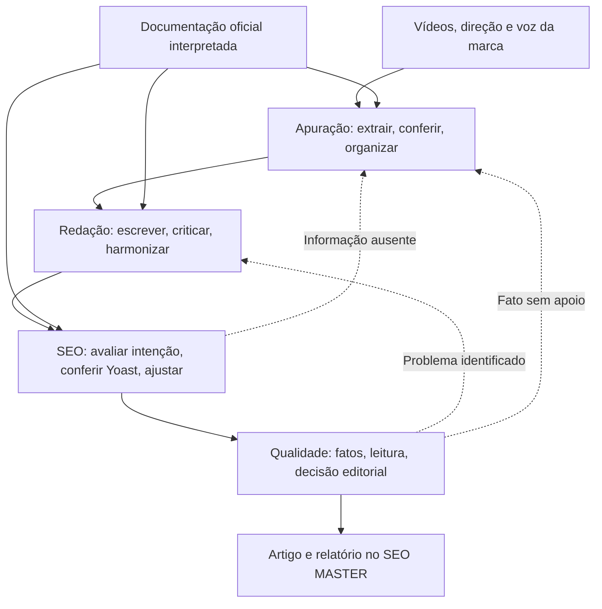

# Redação com equipes de três agentes no SEO MASTER

Status: núcleo implementado na versão 1.1.0. Complementa [a arquitetura de conhecimento e SEO](arquitetura-seo-yoast-ia.md) conforme a direção editorial definida pelo usuário. Consulte [o registro de implementação](implementacao-redacao.md) para o escopo entregue e as diferenças em relação ao desenho inicial.

## 1. Organização

Cada setor é composto por três agentes que trocam entregas, críticas e decisões. Proposta inicial: quatro setores, totalizando doze papéis de IA. Todos operam dentro do SEO MASTER, com a mesma direção editorial e identidade de marca. Nenhuma conexão WordPress é necessária para produzir, analisar ou melhorar o artigo.

“Agente” significa aqui uma execução com objetivo, contexto, ferramentas e formato de resposta próprios. Os agentes podem usar o mesmo provedor e modelo, mas não compartilham uma conversa indiscriminada. Não são doze serviços separados. O aplicativo coordena as tarefas e conserva o estado.

| Setor | Agente 1 | Agente 2 | Agente 3 | Entrega |
| --- | --- | --- | --- | --- |
| Apuração e pauta | Extrator de conhecimento | Checador das fontes | Editor de pauta | Dossiê com evidências, lacunas, exemplos e estrutura do artigo |
| Redação e voz | Redator | Leitor crítico | Editor de voz | Artigo com escrita própria, clareza e padrão de marca |
| SEO | Estrategista de conteúdo | Analista Yoast | Editor de SEO | Diagnóstico e mudanças justificadas pela documentação |
| Qualidade final | Revisor factual | Revisor de leitura | Editor-chefe | Parecer sobre a versão final e pendências objetivas |

Esses setores cobrem responsabilidades diferentes. O orquestrador do aplicativo encaminha mensagens, controla versões e executa validadores; não exige um décimo terceiro agente para escolher livremente o próximo passo.

## 2. Apuração e pauta

**Extrator de conhecimento:** identifica conceitos, procedimentos quando pertinentes à pauta, exemplos, situações concretas, ressalvas e dúvidas presentes nas transcrições. Preserva detalhes úteis e vincula cada afirmação ao trecho de origem. Registra a diferença entre informação, opinião e experiência individual.

**Checador das fontes:** confere o dossiê diretamente contra os trechos originais, identifica contradições, lacunas e generalizações. Solicita pesquisa complementar quando necessário. O resultado do primeiro agente é uma hipótese a conferir, não uma nova fonte factual.

**Editor de pauta:** resolve a estrutura a partir da pergunta do leitor e do material confirmado. Organiza explicações e exemplos em uma sequência útil. Preserva dúvidas ainda não resolvidas e registra o que o artigo pode explicar com segurança.

O material humano do vídeo orienta a escolha de exemplos, preocupações reais e detalhes que fazem diferença. A transcrição não dá acesso automático a gestos, imagens, entonação ou cenas; essas observações só podem entrar se forem analisadas por um recurso apropriado e registradas como fonte.

O resultado é uma pauta sobre o assunto, escrita para quem não assistiu ao vídeo. Não transformar a comunicação, a personalidade ou as motivações do apresentador no tema do artigo, salvo quando essa for a pauta solicitada.

## 3. Redação e voz

**Redator:** desenvolve a pauta com organização e linguagem próprias, usando o perfil editorial e as evidências. Recebe também as orientações SEO essenciais recuperadas pelo aplicativo antes da escrita.

**Leitor crítico:** lê a versão recebida como alguém do público definido. Aponta perguntas não respondidas, saltos de raciocínio, termos não explicados, repetições, introduções demoradas, parágrafos cansativos e exemplos pouco úteis. Cada crítica identifica o trecho e o efeito sobre a leitura.

**Editor de voz:** aplica as correções pertinentes e harmoniza o estilo. Preserva informações e exemplos úteis, reduz burocratês e verifica se o texto parece pertencer à mesma publicação do começo ao fim.

Escrita humana significa explicação concreta, escolhas editoriais e atenção às dúvidas do leitor. Não envolve inserir erros de propósito, inventar depoimentos ou tentar passar em detectores de IA. Experiências do vídeo não devem ser atribuídas ao autor do blog.

## 4. SEO

**Estrategista de conteúdo:** verifica se título, abertura e seções respondem à intenção da pauta; identifica lacunas temáticas, promessas não cumpridas e repetição de informação. Utiliza as orientações do Google e o conhecimento editorial aprovado no app.

**Analista Yoast:** consulta o pacote documental aplicável, interpreta os resultados dos verificadores locais e examina palavra-chave, título SEO, descrição, estrutura e legibilidade. Distingue resultado calculado pelo motor Yoast, verificação própria do app e julgamento feito por IA. Não atribui ao plugin uma pontuação que não foi medida.

**Editor de SEO:** recebe os dois pareceres e propõe ou aplica ajustes localizados, preservando a voz da marca. Justifica cada alteração. Quando uma sugestão mecânica piora a leitura ou muda o sentido, registra a decisão editorial e conserva a alternativa mais clara.

Cada proposta deve responder: qual problema existe, onde está, qual orientação é aplicável, por que a mudança ajuda e como conferir o resultado. A presença de uma recomendação em um documento não obriga a aplicá-la em todos os textos.

O objetivo não é completar uma quantidade de palavras de transição ou repetir a palavra-chave para melhorar uma cor. Conectivos devem indicar relações reais: causa, contraste, sequência, condição ou conclusão. Sinônimos e termos simples precisam conservar o sentido.

Caso uma melhoria dependa de informação nova, este setor retorna uma solicitação à apuração. Caso dependa apenas de estilo, encaminha ao editor de voz. O agente não acrescenta fatos de memória para resolver uma pendência SEO.

## 5. Qualidade final

**Revisor factual:** avalia o artigo final, inclusive título e metadados, contra as fontes originais. Confere números, causalidade, ressalvas, atribuições e experiências. A validação por código de IDs e trechos continua existindo junto dessa avaliação.

**Revisor de leitura:** verifica o artigo completo depois das alterações SEO. Procura linguagem artificial, palavras difíceis sem necessidade, transições excessivas, quebras de tom e perda de fluidez. Ter uma sugestão aceita no setor anterior não dispensa essa leitura final.

**Editor-chefe:** consolida os pareceres e decide se a versão está pronta para o usuário, se precisa retornar a um setor ou se depende de informação que não temos. A decisão deve apontar a evidência e as pendências, não apenas declarar qualidade.

O editor-chefe não pode dispensar uma referência inexistente nem considerar um fato verdadeiro porque os outros agentes concordaram. Concordância entre modelos não substitui prova. Se mudar o texto durante a consolidação, a nova revisão precisa passar novamente pelos verificadores afetados.

## 6. Padrão editorial compartilhado

O app mantém um perfil de voz versionado, carregado em todas as etapas. O campo atual `brand_voice` é o ponto de partida. Evoluir para dados estruturados:

| Campo | Orientação inicial para este projeto |
| --- | --- |
| Público e nível de conhecimento | Definidos na direção de cada artigo |
| Tom | Próximo, claro e seguro, com afirmações proporcionais à evidência |
| Vocabulário | Preferir palavras familiares; explicar termos técnicos necessários na primeira ocorrência |
| Frases e ritmo | Construção direta e variação natural; evitar períodos difíceis de acompanhar |
| Parágrafos | Uma ideia central com desenvolvimento suficiente; extensão conforme o assunto |
| Transições | Usar quando esclarecem a relação entre ideias, sem cotas artificiais |
| Abertura | Apresentar cedo o assunto e a resposta que será desenvolvida |
| Exemplos | Concretos, relevantes e sustentados; exemplos hipotéticos identificados como tais |
| Autoria | Não inventar vivências, testes, formação ou resultados da marca |
| Forma de tratamento | Padrão configurável e consistente ao longo do artigo |
| Exemplos aprovados | Trechos que representam a voz desejada, fornecidos ou aprovados pelo usuário |
| Preferências e exceções | Vocabulário preferido, construções a evitar e termos técnicos que devem ser preservados |

Exemplo de estilo:

“Ademais, faz-se imprescindível a observância dos fatores supramencionados para a consecução do resultado.”

Pode virar, quando o contexto sustenta essa relação:

“Esses fatores influenciam o resultado.”

A simplificação precisa preservar o significado. Não apagar uma condição ou ressalva apenas para encurtar a frase. Listas de palavras complexas são sinais para revisão, não substituições automáticas indiscriminadas.

Aprovar uma correção em um artigo não altera silenciosamente a voz de todos os próximos. Mudanças globais no perfil são ações específicas; novas versões do perfil ficam identificadas no histórico.

## 7. Como os agentes se comunicam

Dentro de cada trio: proposta → crítica independente → consolidação. Agentes críticos recebem o artigo e as fontes relevantes, não só a justificativa de quem o escreveu. Pareceres independentes que avaliam a mesma revisão podem executar em paralelo; edições são aplicadas em sequência pelo coordenador.

Entre setores, usar mensagens estruturadas com remetente, destinatário, revisão, trecho afetado, problema, evidências, referência documental, mudança proposta e situação. Tipos de mensagem: `question`, `finding`, `proposal`, `decision` e `research_request`.

Exemplo de conversa útil:

- Analista Yoast: “A pauta não aparece claramente na abertura. Sugiro apresentar o preparo de café coado na primeira frase.”
- Editor de voz: “A primeira frase já deixa o assunto claro. Repetir a expressão na frase seguinte deixa o parágrafo pesado. Proponho ajustar apenas o título.”
- Editor de SEO: registra a decisão e confere o título proposto; se a introdução já cumpre sua função, encerra o apontamento com justificativa.

As mensagens são decisões e evidências operacionais, não transcrições de raciocínio interno dos modelos. Não enviar toda a conversa acumulada a cada chamada: montar o contexto necessário a partir dos artefatos e apontamentos abertos.

## 8. Memória, documentos e controle de versões

Quatro conjuntos de contexto, explicitamente identificados:

1. **Fontes do assunto:** vídeos, transcrições, pesquisa e evidências confirmadas.
2. **Voz da marca:** perfil editorial e exemplos aprovados.
3. **Conhecimento SEO:** trechos oficiais, fichas interpretadas e regras versionadas.
4. **Estado do artigo:** versão atual, propostas, pendências e decisões já registradas.

A documentação de SEO é indexada e recuperada conforme a tarefa. Os agentes recebem o significado das orientações, exemplos e condições de aplicação, além das referências de origem. Conteúdo documental não entra como texto a ser transformado em artigo nem como evidência de fatos do tema.

Persistir `agent_runs`, `agent_messages`, `editorial_profiles`, `sector_reviews` e `change_sets`, vinculados às revisões existentes. Cada execução registra papel, entradas, modelo, versão das instruções, perfil editorial, pacote documental, saída, uso e situação. Preservar segredos no backend; dados de execução privados não vão ao repositório público.

Cada alteração leva `base_revision`, alvo, hash do trecho anterior e conteúdo proposto. O aplicativo rejeita aplicação sobre uma versão diferente. Auditorias e aprovações só valem para a revisão que realmente examinaram.

## 9. Regras de decisão e retorno

O orquestrador implementa uma máquina de estados com entregas esperadas. Ele não aceita o sinal “pronto” enquanto houver erro de integridade ou revisão obrigatória pendente.

| Divergência | Encaminhamento |
| --- | --- |
| Correção estilística muda um fato | Voltar à redação e à conferência factual |
| Sugestão SEO deixa o texto artificial | Editor de voz e editor de SEO resolvem com justificativa registrada |
| Falta evidência para uma informação útil | Apuração pesquisa ou registra a lacuna |
| Regra não se aplica ao formato | Marcar como não aplicável e indicar o motivo |
| Falta URL real para link interno | Manter sugestão pendente; não inventar destino |
| Três agentes concordam sem evidência | Continuar como não confirmado |
| Artigo sofreu edição manual | Invalidar avaliações dependentes e não sobrescrever o texto do usuário |

Fidelidade e clareza delimitam as correções. Dentro desses limites, buscar a melhor aplicação das orientações SEO. Integridade das referências e consistência de versão são verificações de código; decisões estilísticas são justificadas, com possibilidade de intervenção do usuário.

Cada retorno deve informar o problema a resolver e o critério de conclusão. Rodadas adicionais, orçamento e escopo de automação são configuráveis. Quando uma divergência persistir, mostrar a pendência em vez de consumir chamadas indefinidamente ou declarar sucesso.

## 10. Integração no aplicativo atual

Ampliar `pipeline.py` para coordenar setores e seus estados. Separar instruções e contratos de cada papel em `app/editorial/agents/`. Implementar recuperação documental em `app/seo/knowledge/`, verificadores em `app/seo/checks/` e aplicação de alterações em `app/editorial/changes.py`.

Reutilizar o mecanismo de chamadas estruturadas de `generation.py`, as evidências e validações existentes, o cache de transcrições, o histórico e as configurações privadas. Uma execução por papel retorna um objeto validável. O esquema exato da API e o modelo são decisões da implementação, sem exigir um framework de agentes externo para coordenar esse fluxo.

Tela proposta: “Equipe editorial”, mostrando etapa atual, entregas dos setores e pendências resolvidas. O usuário vê o diagnóstico e as alterações, com comandos para comparar, aceitar, rejeitar e desfazer. É possível configurar aplicação automática dentro do app; a revisão final continua avaliando a versão efetivamente produzida.

O relatório separa fidelidade, leitura, voz e SEO. Exibe o que foi conferido, corrigido ou ficou pendente. Não inventar uma porcentagem de qualidade nem afirmar que o artigo recebeu certificação do Google ou Yoast.

## 11. Custo e avaliação da qualidade

Um ciclo que executa os doze papéis separadamente tende a ter doze chamadas principais, além de pesquisa e eventuais retornos. O número de agentes aumenta custo e latência; o ganho precisa ser medido. Evitar refazer setores com entradas idênticas e reaproveitar transcrições, documentos e artefatos válidos por hash.

Todos os três agentes de cada setor participam do primeiro ciclo completo. Uma correção posterior recalcula apenas as dependências afetadas. Exemplo: mudança de título SEO pode exigir nova análise de metadados e conferência de fidelidade do título, sem extrair novamente o vídeo.

Avaliar antes de ativar o novo fluxo como padrão:

- Comparação editorial cega entre o fluxo atual e o fluxo em equipes, usando a mesma pauta e as mesmas fontes.
- Casos em que a recomendação correta é não modificar um trecho que já está claro.
- Excesso de conectivos, jargões, repetição de palavra-chave, mudanças de tom e introduções vagas.
- Preservação de exemplos humanos úteis e de ressalvas importantes.
- Nenhuma experiência pessoal inventada para parecer mais humano.
- Nenhum fato novo sem suporte após a etapa SEO.
- Casos de conflito entre setores, edição concorrente e revisão vencida.
- Recuperação da documentação adequada e vinculação correta entre regra e justificativa.
- Custo, tempo, alterações aceitas e ajustes rejeitados por artigo.

Mais agentes não asseguram qualidade por si só. A arquitetura busca melhorar a verificação por funções distintas, críticas independentes e critérios observáveis. A avaliação humana e os testes determinam se o resultado atingiu o padrão editorial desejado.

## 12. Ordem de implementação

1. Formalizar a voz da marca e preparar a base documental interpretada, com exemplos e exceções.
2. Implementar o coordenador, os contratos dos doze papéis, mensagens e histórico de versões.
3. Conectar os quatro setores ao fluxo atual e às validações de evidência.
4. Entregar comparação, aplicação de alterações e relatório por setor no app.
5. Validar a qualidade com artigos de teste e ajustar instruções, contextos e número de retornos.

O resultado esperado é um artigo fiel ao material humano de referência, com explicação própria, voz consistente, leitura fluida e melhorias SEO justificadas. Todo esse processo ocorre dentro do SEO MASTER.
